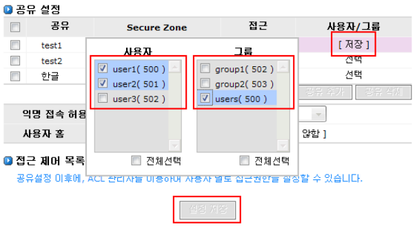

# 6.8 FTP

FTP는 서로 다른 시스템간의 데이터를 공유하기 위해 사용하는 프로토콜입니다. AnyStor NAS는 FTP client가 NAS에 직접 연결하여 FTP 공유를 할 수 있도록 지원합니다. NAS 스토리지를 활용하여 NAS 를 FTP server 로 운영할 수 있습니다. \( 단, 많은 사용자의 접속으로 인해 NAS 자체의 공유기능이 저하될 수 있습니다. FTP 사용자가 많을 경우, 별도의 FTP server 를 운영하시기 바랍니다. \)   
  
 FTP 설정은 [\[공유\]-\[설정\]](ftp.md#62-공유-설정) 메뉴에서 설정한 공유 목록에 대해 [\[FTP\]](ftp.md#68-FTP) 메뉴에서 FTP 공유를 설정하고 접근 권한을 제어합니다.

  
 \[ 그림 6.8 FTP 설정 \]

## 6.8.1 FTP 시작

### ▶ FTP 서비스의 시작

> ① FTP서비스를 시작하기 위해서 \[시스템\]-\[서비스\] 의 File Transfer Protocol 서비스 데몬을 가동시켜야 합니다.

  
 \[ 그림 6.8.1 FTP 서비스 데몬 시작 \]

> ② FTP서비스의 종료는 데몬을 중지시키는 동작으로 가능합니다.

  
 \[ 그림 6.8.2 FTP 서비스 데몬 증지 \]

## ▶ FTP 기본 설정

  
 \[ 그림 6.8.3 FTP 서비스 데몬 증지 \]

> **A. 포트 설정** : FTP 접속에 사용할 사용자 포트\(port\)를 설정할 수 있습니다. 기본설정값은 2 1 입니다. FTP 는 접속을 위한 connection-port 와 데이터 전송을 위한 data-port 를 별 도로 사용합니다. 이 메뉴에서 수정되는 포트는 connection-port 입니다. 일부 네트워크 에서 data-port 가 할당되지 않아 FTP 서비스가 되지 않을 수 있습니다. 이 경우는 FTP cl ient 에서 passive 모드로 접근하시기 바랍니다.
>
> **B. 최대 접속자 수 설정** : FTP 에 접속할 수 있는 최대 세션의 수\(동시 접속자 수\)를 설정할 수 있습니다. 단, 최대 접속 허용 수를 크게 설정하게 되면 동시 접속이 많아 질수록 NAS 의 기본 성능이 저하 될 수 있습니다.
>
> **C. 사용자/익명 접속 메시지 설정** : FTP client 를 통해 접속하는 사용자들이 처음으로 보게 되는 메시지를 설정합니다 한글입력을 지원합니다. 익명 접속 메시지는 익명연결로 접속 한 사용자에게만 전달됩니다.

## 6.8.2 FTP 공유 설정

\[공유\]-\[설정\] 에서 생성한 공유 목록 중 일부를 FTP용 공유로 설정할 수 있습니다

  
 \[ 그림 6.8.4 FTP 서비스 데몬 증지 \]

### ▶ FTP 공유 설정

> A. \[공유\]-\[설정\] 에 공유가 존재하지 않다면 \[공유\]-\[설정\] 메뉴에서 하나 이상의 공유를 설 정합니다. CIFS, NFS, ATALK 서비스 설정과는 무관합니다.
>
> B. \[네트워크\]-\[보안\] 에서 FTP 가 사용할 보안영역을 설정해 줍니다.
>
> C. \[ 그림 6.8.5 \] 은 버튼을 클릭 후, 공유 필드의 선택박스를 클릭한 화면입니다.

  
 \[ 그림 6.8.5 공유 생성 화면 \]

> D. 새 공유에서 FTP 에서 공유할 공유를 선택하고 Secure Zone\(보안영역\) 을 체크합니다. 여러 Secure Zone 이 존재하는 경우 접근을 허용할 Zone 만 선택 체크합니다.
>
> E. 접근 필드에서 읽기 혹은 읽기/쓰기 중 하나로 접근권한을 선택합니다.
>
> F. 또 다른 공유를 설정 시에는 **공유추가** 버튼을 클릭하여 설정할 공유의 수만큼 생성하시면 됩니다.
>
> G. \[ 그림 3.8.6 \] 은 3개의 공유를 생성하고 공유명과 Section Zone, 접근권한 을 설정한 화면입니다.
>
> H. 설정에 이상이 없다면 **설정 저장** 버튼을 클릭합니다.

  
 \[ 그림 6.8.6 공유 추가 – 저장 전 화면 \]

> I. \[그림 6.8.7\]은 설정을 저장한 후 접근 가능한 사용자와 그룹을 설정하기 위한 화면입니다.

  
 \[ 그림 6.8.7 공유 추가 – 저장 후 화면 \]

> J. **사용자/그룹** 필드의 **선택** 을 클릭하면 사용자 및 그룹의 리스트가 표시됩니다. \( 단, **선택** 버튼은 공유접근모드가 ACL 모드가 아닌 경우 표시되며, ACL 모드 시에는 **ACL** 로 표시 됩니다. ACL 모드에서 사용자/그룹 의 접근권한은 ACL 관리자를 통해 제어됩니다. ACL 관리자에 대한 설명은 [Access Control List 관리자](ftp.md#69-ACL-관리자) 를 참고하세요.\)
>
> K. \[그림 6.6.8\]는 사용자 및 그룹을 선택하는 화면입니다. 접근을 허용할 사용자와 그룹을 선택하고 오른쪽 상단의 **\[저장\]**을 클릭합니다. 모든 공유에 대해 사용자/그룹을 설정하고, 설정저장 버튼을 클릭합니다

  
 \[ 그림 6.6.8 공유 추가 – 사용자/그룹 접근 설정 \]

> L. 생성된 공유정보의 공유명과 Secure Zone Secure Zone 에 마우스를 올리면 각각 공유경로와 접근가능 IP 영역이 표시됩니다.

### ▶ FTP 공유 수정

> A. 생성된 공유에 대해 공유명을 제외한 모든 항목을 수정할 수 있습니다.
>
> B. 수정이 필요한 공유의 해당 필드에 마우스를 클릭합니다.
>
> C. \[ 그림 6.8.9 \] 은 공유test1의 Secure Zone 과 공유test2의 접근권한을 수정하기 위해 클릭한 화면입니다. 선택 후 필요한 부분을 수정하고 **설정저장** 버튼을 클릭합니다.

  
 \[ 그림 6.8.9 공유 수정 – 수정필드 선택 \]

> D. 사용자/그룹 의 수정은 공유생성과 동일한 방법으로 선택을 클릭하고 사용자와 그룹을 변경 후 **\[ 저장 \]** 이후 최종 단계에서 **설정 저장** 버튼을 클릭합니다.
>
> E. 새로운 공유를 추가하려면 오른쪽 아래 버튼을 클릭합니다. 공유생성과 동 일한 방법으로 새로운 공유 필드가 생성됩니다. 공유명과 공유정보를 추가하시고 **설정 저장** 버튼을 클릭합니다.

### ▶ FTP 공유 삭제

> A. 더 이상 공유하지 않거나 잘못 생성된 공유는 삭제할 수 있습니다.
>
> B. \[ 그림 6.8.10\] 은 공유test1을 삭제하는 과정입니다. 공유test1을 체크하고 버튼을 클릭 하여 공유 필드를 제거합니다. 설정이 다 되었으면 **공유 삭제** 버튼을 클릭하여 저장합니다.

  
 \[ 그림 6.8.10 공유 삭제 \]

### ▶ FTP 익명 접속 영역 사용

> A. FTP client 가 FTP server 에 접근하기 위해선 FTP server 에서 인증하는 사용자ID 와 비 밀번호가 있어야 합니다. 익명접속은 별도의 사용자ID 와 비밀번호 없이 Anonymous 로 접근 가능하도록 설정된 공유로 사용자/그룹에 대한 접근허용을 제외한 보안영역과 접 근권한\(읽기/쓰기\)만 적용됩니다.
>
> B. **익명 접속 허용 경로**는 이미 생성된 공유들 가운데 하나를 선택할 수 있습니다. 익명접 속 공유는 기존에 생성된 공유와 같은 보안영역으로 설정되나 접근권한\(읽기/쓰기\)은 별 도로 설정 가능합니다.

  
 \[ 그림 6.8.11익명 접속 허용 경로 설정 \]

### ▶ FTP 사용자 홈 영역 사용

> A. FTP client 는 공유를 목적으로 한 볼륨을 사용할 수도 있고, 각 사용자 별 고유공간을 생 성하여 사용자 홈 영역으로 사용할 수도 있습니다.
>
> B. 사용자 홈 영역을 사용하기 위해서는 먼저 **\[ LVM \]-\[ 논리 볼륨 \]** 에서 FTP 홈 영역으로 사용할 볼륨을 생성해야 합니다. 자세한 볼륨생성 요령은 [“논리 볼륨 설정”](ftp.md##33-논리-볼륨-설정)을 참고 하시기 바랍니다.

  
 \[ 그림 6.8.12 사용자 홈 – 생성 및 저장 \]

> C. \[ 그림 6.8.12 \]은 **\[ LVM \]-\[ 논리 볼륨 \]**에서 FTP 홈 영역 생성 직 후 FTP 설정화면입니 다. 기존에 생성한 정보에서 FTP 홈 영역이 사용되지 않았으므로 변경된 홈 영역에 대한 정보를 표시합니다. 홈 영역에 대한 설정을 저장하기 위해 **설정 저장**버튼을 클릭합 니다.
>
> D. 사용자 홈 영역은 개별 사용자 마다 고유한 공간을 할당하고 사용하게 됩니다. 그러나 기 존에 생성되었던 사용자들의 정보는 새롭게 추가한 사용자 홈 영역에 포함되지 않습니 다. 초기 사용자 홈 사용시나 접속자의 홈 폴더가 누락되었을 경우, **홈 폴더 생성**버튼을 클릭합니다.

* ※ 사용자 홈 영역 사용중에 새롭게 추가되는 사용자는 자동으로 사용자 홈 영역에 홈 폴더가 생성됩니다. 

  
 \[ 그림 6.8.13 사용자 홈 – 적용 \]

## 6.8.3 FTP 사용자 접속

> A. Anystor NAS 의 FTP server 는 FTP client 로 대부분의 범용 프로그램을 지원합니다.
>
> B. 파일 encoding 은 UTF-8 과 EUC\_KR 을 지원합니다. \( 기본은 UTF-8 입니다. \)
>
> C. 특정 FTP client 는 UTF-8 을 지원하지 않을 수 있습니다. 이 경우 UTF-8 을 지원하는 다 른 FTP client 를 사용하거나 NAS 의 파일 encoding 을 EUC\_KR 로 설정하셔야 합니다. \( 단, NAS의 인코딩을 EUC\_KR 로 수정 시 CIFS 공유도 EUC\_KR 이어야 합니다. \)

