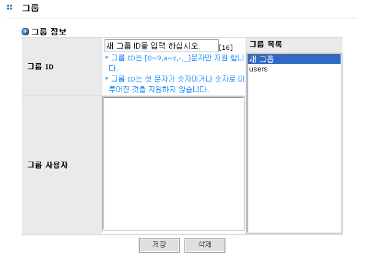

## 5.3 그룹

그룹 관리 메뉴에서는 그룹의 삽입, 삭제에 대한 설정이 가능합니다. 그룹 관리는 [계정]-[그룹] 메뉴에
서 수행하며, 다음과 같은 순서로 설정합니다.
  
[그림 5.3]은 그룹을 설정한 예입니다.

  
[ 그림 5.3 그룹의 관리 ]

### 5.3.1 그룹 입력

>	① '그룹 목록’에서 ‘새 그룹’ 선택

>	② ‘그룹 ID’필드에서 그룹 ID 입력

>	③ ‘저장’ 버튼을 클릭하여 그룹 저장

>	④ 생성된 그룹에 사용자를 추가시키는 것은 [[계정]-[사용자]](#52-사용자) 메뉴의 사용자 등록 과정에서
수행할 수 있습니다(세부사항은 [[사용자]](#52-사용자)  메뉴 참조)

### 5.3.2 그룹 삭제

>	① 삭제하고자 하는 그룹을 ‘그룹 목록’에서 선택합니다.

>	② ‘삭제’버튼을 클릭하여 삭제합니다.
