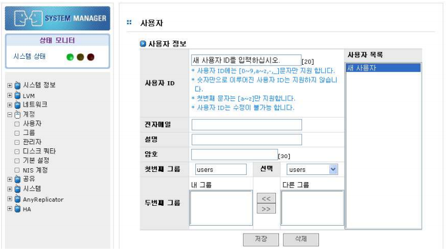

# 5 계정

## 5.1 계정 개요

AnyStor NAS를 사용하기 위해서는 AnyStor NAS에 계정 등록이 되어 있어야 합니다. AnyStor는 로컬
사용자뿐만 아니라 ADS 및 NIS 서비스를 통한 원격 사용자의 인증을 제공합니다.
본 절에서는 AnyStor NAS 를 이용하기 위한 사용자 계정의 관리, 관리자 관리, 및 사용자 쿼타의 설정
등 계정 관리를 위한 기능에 대해 설명합니다.
 
[그림 5.1.1]은 계정관리를 위한 GUI 입니다. AnyStor NAS 의 AnyStor 웹 관리 도구를 통한 계정 관리
기능은 다음과 같습니다.

>	A. 사용자 계정 관리

>	B. 그룹 계정 관리

>	C. 관리자 암호 관리

>	D. 디스크 쿼타 관리

>	E. 기본 설정 관리

>	F. NIS 계정 정보

  
[ 그림 5.1.1 계정 관리 ]