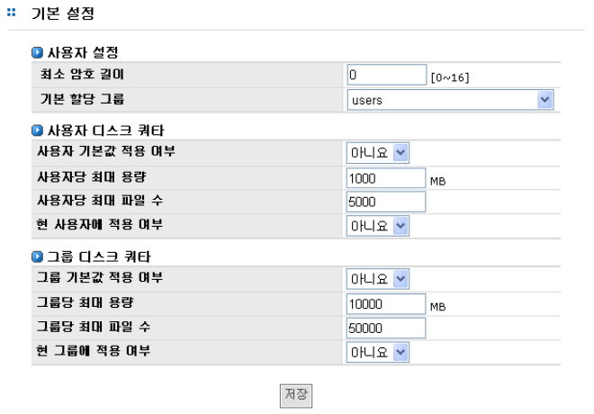
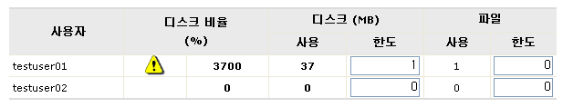
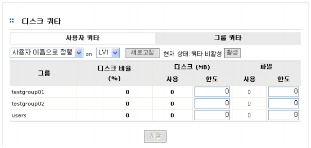

## 7.5 디스크 쿼터 관리

AnyStor NAS는 사용자별 또는 그룹별 디스크의 사용량을 관리할 수 있도록 하는 디스크 쿼타(디스크
쿼타) 기능을 제공합니다. 디스크 쿼타의 설정 및 관리는 [계정]-[디스크 쿼타] 메뉴와 [계정]-[기본 설정]
메뉴를 활용하여 관리가 가능합니다.
  
[그림 7.5]는 디스크 쿼타 설정을 위해 우선적으로 수행해야 하는 기본 템플릿 설정을 위한 GUI를 보
여주고 있습니다.

  
[ 그림 7.5 기본 설정 ]

### 7.5.1 사용자 쿼터 설정을 위한 기본 템플릿 설정

>	A. 새로운 사용자를 위한 디스크 쿼터 가능 여부 설정 : 예 또는 아니요

>	B. 사용자 별 최대 디스크 사용량 설정

>	C. 사용자 별 최대 파일 개수의 설정

>	D. 이미 존재하는 사용자에 대한 디스크 쿼터 적용여부 설정 : 예 또는 아니요

### 7.5.2 그룹 쿼타 설정을 위한 기본 템플릿 설정

>	A. 새로운 사용자를 위한 디스크 쿼터 가능 여부 설정 : 예 또는 아니요

>	B. 그룹별 최대 디스크 사용량 설정(단, 사용자 별 최대 디스크 사용량 설정 값보다 큰 값으
로 입력 필요)

>	C. 그룹별 최대 파일 개수의 설정(단, 사용자 별 최대 파일 개수 설정 값보다 큰 값으로 입력
필요)

>	D. 이미 존재하는 그룹에 대한 디스크 쿼터 적용 여부 설정 : 예 또는 아니요

### 7.5.3 사용자 쿼타 설정

>	A. 사용자 쿼터의 설정은 기본 템플릿 설정을 기반으로 합니다. 기본 템플릿에서 최대 사용
량과 최대 사용 가능 파일의 수가 설정되어 있으면, 기본 사용자 쿼터는 기본 템플릿 설
정에서 설정한 값으로 기본값이 설정됩니다.

>	B. 각 사용자 별로 설정 값을 변경하려면 [계정]-[디스크 쿼타]-[사용자 쿼타] 메뉴로 이동합
니다.

>	C. [계정]-[디스크 쿼타]-[사용자 쿼타]로 이동합니다.

>	D. [그림 7.5.1]은 쿼타가 비활성 상태 입니다. **“활성”**버튼을 클릭하면 각 사용자에 대한 볼
륨 별 디스크 사용 현황 및 쿼터 설정 현황을 볼 수 있습니다.

 
[ 그림 7.5.1 사용자 쿼타 ]

>	E. 시스템 관리자의 편의를 위하여 다음과 같은 기준에 의해 정렬이 가능합니다.

>	>	a. 사용자 오름차순 우선 정렬

>	>	b. 디스크 쿼터 제한에 가장 접근한 사용자 우선 정렬

>	>	c. 파일 개수 쿼터 제한에 가장 접근한 사용자 우선 정렬

>	>	d. 최대 디스크 사용량을 가지는 사용자 우선 정렬

>	>	e. 최다 파일 개수를 가지는 사용자 우선 정렬

>	F. 각 사용자에 대한 디스크 쿼터 및 최대 파일 개수 설정 변경이 가능합니다. 단 새로 설정
한 값이 사용자의 현재 사용량보다 작은 경우 [그림 7.5.2]에서 보여주는 것처럼 비정상
적인 사용자 쿼터 설정에 대한 경고 표시 가 나타납니다.

>	G. 그룹별 최대 파일 개수의 설정(단, 사용자 별 최대 파일 개수 설정 값보다 큰 값으로 입력필요)

 
[ 그림 7.5.2 비정상적인 사용자 쿼타 설정의 예 ]

### 7.5.4 그룹 쿼타 설정

>	A. 그룹 쿼터의 설정은 기본 템플릿 설정을 기반으로 합니다. 기본 템플릿에서 최대 사용량
과 최대 사용 가능 파일의 수가 설정되어 있으면, 쿼터는 기본 템플릿 설정에서 설정한
값으로 기본값이 설정됩니다.

>	B. 각 그룹 별로 설정값을 변경하려면 [계정]-[디스크 쿼타]-[그룹 쿼타] 메뉴로 이동합니다.

 
[ 그림 7.5.3 그룹 쿼타 ]

>	C. [계정]-[디스크 쿼타]-[그룹 쿼타]로 이동하여 볼륨 별 **“활성”**버튼을 클릭하면 각 그룹에
대한 볼륨 별 디스크 사용 현황 및 쿼터 설정 현황을 볼 수 있습니다. 시스템 관리자의
편의를 위하여 다음과 같은 기준에 의해 정렬이 가능합니다.

>	>	a. 그룹명 오름차순 우선 정렬

>	>	b. 디스크 쿼터 제한에 가장 접근한 그룹 우선 정렬

>	>	c. 파일 개수 쿼터 제한에 가장 접근한 그룹 우선 정렬

>	>	d. 최대 디스크 사용량을 갖는 그룹 우선 정렬

>	>	e. 최다 파일 개수를 가지는 그룹 우선 정렬

>	D. 각 사용자에 대한 디스크 쿼터 및 최대 파일 개수 설정 변경이 가능합니다. 단 새로 설정
한 값이 사용자의 현재 사용량보다 작은 경우 [그림 7.5.2]에서 보여주는 것처럼 비정상
적인 그룹 쿼터 설정에 대한 경고 표시 가 나타납니다.

## 7.6. 기본 설정

[그림 7.5]를 참조하시기 바랍니다.

## 7.7 NIS 계정

NIS 서버와 클라이언트의 설정이 정상적으로 되었다면 NIS 서버에 등록이 되어있는 사용자와 그룹에
대한 정보가 보일 것입니다. 만약 정상 동작이 되고 있지 않다면 “NIS 사용 중이 아닙니다.” 이라는 메시
지가 보일 것입니다.

 