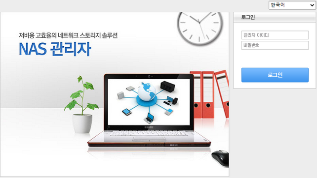

# 1 AnyManager – System manager

 
AnyStor NAS는 AnyManager를 통해서 시스템 관리를 할 수 있습니다.
 
AnyManager는 AnyStor NAS의 웹 원격 관리도구 입니다

## 1.1 Logging In/Out
### AnyManager에 로그인 하려면
> ① 일반 PC에서 Internet Explorer(버전 4.0이상) 작동시키십시오.   
> ② 관리하고자 하는 AnyStor NAS의 웹 주소(<http://주소/admin.html>)를 입력하면, 아래 [그림 1.1]과 같이 로그인 화면이 보입니다.  
> ③ 시스템 관리자의 ID와 암호를 넣으시고 **‘로그인’** 버튼을 누르십시오. 암호는 [[계정]-[관리자]](#54-관리자)  메뉴에서 수정이 가능합니다. 
> ④  시스템 관리자로 초기 암호는 **ID : admin / Password : admin** 입니다

  
 [ 그림 1.1 AnyManager 초기 화면] 
