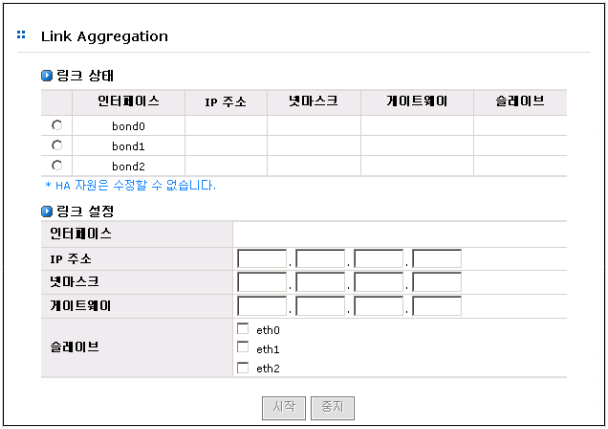
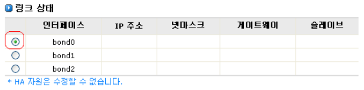
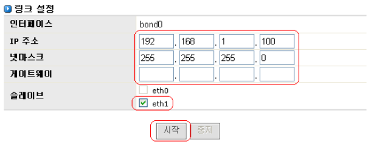
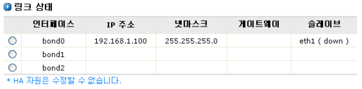

## 4.4 Link Aggregation

AnyStor NAS는 시스템의 failover와 load balancing을 지원합니다. 2개 이상의 네트워크 어댑터를 하
나의 팀으로 구성하며, 구성된 팀은 데이터의 수신과 전송을 동시에 수행합니다. 이 경우 하나의 네트워
크 어댑터나 케이블의 문제가 발생시 다른 살아있는 링크를 이용하여 통신이 가능하므로 지속적인 서비
스를 제공할 수 있습니다.

 
Link Aggregation이 제공하는 기능은 다음과 같습니다. ( 초기 시스템 설정 시 변경이 가능한 부분입니
다. 사용자 변경 불가능 하며, 변경 시 기술지원에 문의하시기 바랍니다. )

>	**A. Failover Teaming**

>	어댑터에 문제가 발생하거나 케이블이 손상되었을 때 내결합성을 제공합니다. 어댑터들은 팀
으로 구성되며 primary 어댑터에 문제가 발생하여 다운되었을 때 secondary 어댑터가 활성화
됩니다. 이로 인해 어댑터가 문제를 발생시켜도 사용자는 아무런 어려움 없이 세션을 유지시
킬 수가 있습니다.

>	**B. Load Balance**

>	팀을 구성하고 있는 어댑터 중 어느 한쪽에 로드가 집중될 때 로드가 다시 측정되어 살아있는
다른 어댑터에 부하를 분산시킵니다. 이로 인해 부하가 균형을 이루게 되며 성능을 향상시킬
수가 있습니다.

>	**▶ Link Aggregation 설정**

>	Link Aggregation 설정항목에서는 가상어댑터의 IP Address, Netmask, Gateway등을 설정할 수 있으며
가용어댑터의 팀 구성을 선택할 수 있습니다. 

[그림 4.4.1]은 Link Aggregation의 설정관리를 위한 웹 GUI입니다

  
[ 그림 4.4.1 Link Aggregation의 설정 ]

 
① 링크 상태에서 우선 팀을 대표하는 인터페이스를 선택합니다.

  
[ 그림 4.4.2 인터페이스 선택 ]

 
② 그 후 링크 설정 부분의 IP주소, 넷마스크, 게이트웨이 값을 설정해 준 뒤 팀에 참여하는
멤버 네트워크 어댑터(슬레이브)들을 선택합니다.

  
[ 그림 4.4.3 설정 정보 설정 ]

 
③ **시작** 버튼 을 클릭하여 Link Aggregation 기능을 동작시킵니다.

  
[ 그림 4.4.4 Aggregation 설정 완료 ]

 
④ Link Aggregation 해제를 원할 경우, 먼저 링크 상태에서 정지하고자 하는 인터페이스를
선택한 뒤 **중지** 버튼을 클릭합니다. 가상어댑터는 사라지고, 이전 IP Address로 돌아
가게 됩니다.
