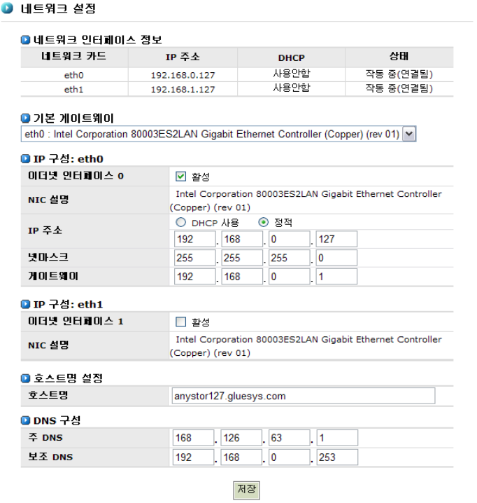
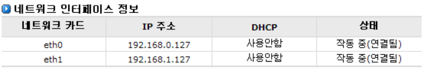
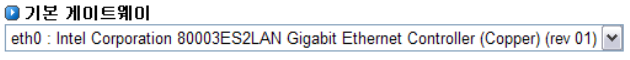
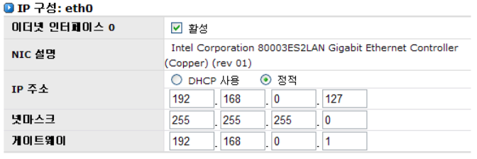
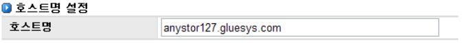
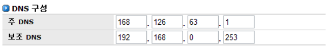

# 4 네트워크 관리

 
AnyStor NAS는 네트워크 스토리지입니다. 따라서 외부의 클라이언트가 네트워크를 통해 AnyStor N
AS에 접속할 수 있도록 IP 주소를 포함한 네트워크의 설정이 필요합니다. AnyStor NAS는 AnyStor 웹
관리 도구를 활용하여 모든 네트워크 설정이 가능합니다.

 
AnyStor 웹 관리 도구를 통한 네트워크 설정은 다음과 같습니다.

>	A. 네트워크 설정

>	B. 보안

>	C. 공유 네트워크 구성

>	D. NIS 설정

>	E. Link Aggregation

>	F. 라우팅

## 4.1 네트워크 설정

[그림 4.1.1]은 네트워크 기본 설정을 위한 GUI입니다. 네트워크 기본 설정을 위해 수행할 사항은 다음과
같습니다.

>	A. 기본 게이트웨이 : 네트워크 기본 게이트웨이 인터페이스를 설정

>	B. IP 구성: 각 네트워크 인터페이스에 대한 IP주소, 넷 마스크, 게이트웨이 설정

>	C. 호스트명 설정: NAS 장비의 호스트명 설정

>	D. DNS 설정 : 기본 DNS 및 보조 DNS 설정

  
[ 그림 4.1.1 네트워크 기본 설정을 위한 GUI ]

#### ▶ 네트워크 정보

>	각 네트워크 인터페이스에 대한 정보를 보여줍니다. [그림 4.1.2]은 각 네트워크 인터페이스에 대한 정보
를 보여주는 GUI입니다.

  
[ 그림 4.1.2 네트워크 인터페이스 정보 ]

#### ▶ 기본 게이트웨이 설정

>	기본 게이트웨이를 설정할 네트워크 인터페이스를 선택합니다. [그림 4.1.3]은 기본 게이트웨이를 설정
하는 GUI입니다. 

  
[ 그림 4.1.3 기본 게이트웨이 설정 ]

#### ▶ IP 설정

각 네트워크 인터페이스에 대한 IP 설정을 할 수 있습니다. 다수의 IP가 존재할 경우 시스템 내에 존재하
는 네트워크 인터페이스의 수 만큼의 설정 인터페이스가 생성됩니다. 따라서 관리자는 생성된 설정 인
터페이스에 각 네트워크 어댑터에 대한 설정 값을 입력할 수 있습니다. [그림 4.1.4]는 IP 설정을 위한 G
UI 입니다.  
IP 설정은 다음과 같은 순서로 수행합니다.

  
[ 그림 4.1.4  IP 설정 ]

>	A. **‘이더넷 인터페이스 0’**에 대한 사용 여부를 설정

>	B. 호스트 이름 설정

>	C. DHCP를 사용할 경우 DHCP로 IP를 할당받도록 설정

>	D. DHCP로 IP 주소를 할당받지 않을 경우 IP 주소 설정(예 : 163.152.39.135)

>	E. 넷마스크 설정(예 : 255.255.255.0)

>	F. 게이트웨이 설정(예 : 163.152.1.1)

>	G. 2개 이상의 이더넷 인터페이스가 존재할 경우 위 순서와 동일하게 IP 설정을 반복

#### ▶ 호스트명 설정

  
[ 그림 4.1.5  호스트명 설정 ]

>	① 호스트명을 입력합니다.

>	② 설정이 끝나면 **저장** 버튼을 클릭합니다.

#### ▶ DNS 설정

  
[ 그림 4.1.6 DNS 설정 ]

>	① 주 DNS를 설정합니다.

>	② 보조 DNS를 설정합니다. 이 값은 옵션 사항입니다.

>	③ 모든 설정이 끝나면 **저장** 버튼을 클릭합니다.