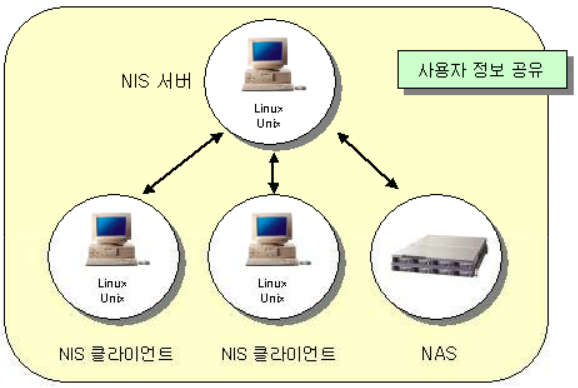
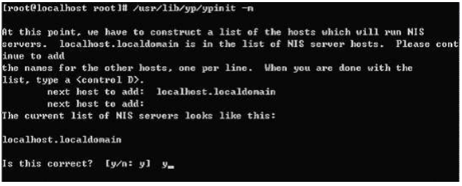
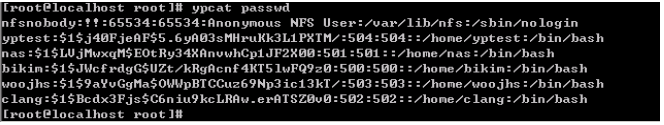
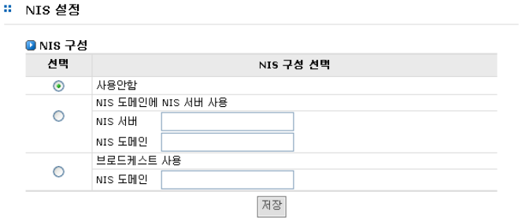

## 6.4 NIS 설정

NIS(Network Information Service)는 Unix 계열의 시스템 간의 정보의 공유를 지원합니다.
AnyStor NAS는 사용자 정보, 패스워드 정보, 그룹 정보 등 다양한 시스템간의 정보를 공유할 수 있도록
NIS를 지원합니다. NIS를 사용함으로써 시스템의 관리자는 여러 시스템의 같은 정보를 모든 시스템에
입력해야만 하는 번거로움을 해소할 수 있습니다. NIS 서버로 지정된 호스트를 통하여 NIS 클라이언트
로 지정된 모든 호스트는 NIS 서버의 모든 정보를 사용 할 수 있습니다.

<br>
 <br>
[ 그림 6.4.1 NIS 기본 동작 ]

<br>
기본 동작은 [그림 6.4.1]와 같습니다. NIS 클라이언트는 NIS에게 필요한 정보를 요청하면 NIS 서버
는 NIS 클라이언트의 요청에 대한 응답을 하는 방식으로 동작을 합니다. 모든 NIS 서버와 NIS 클라이언
트는 NIS 도메인에 모두 속해 있어야 합니다.
<br><br>
NIS 도메인이란, NIS를 사용하고자 하는 호스트들을 묶어 놓은 하나의 그룹입니다.

### 6.4.1 NIS 설정 과정

+ ※ 본 매뉴얼에서 NIS에 대한 설정은 Linux 기반으로 설명합니다. 기타 다른 Unix 계열의 시스템에서의 설정은 다른 참
고 자료를 이용하여 설정해야 할 것입니다.

① NIS가 시스템에 설치되어 있는가를 알아보고 설치되어 있지 않다면 패키지를 다운 받아서 설치해야 합니다. <ftp://ftp.kernel.org/pub/linux/utils/net/NIS/>

② NIS를 사용하려는 호스트는 우선 NIS 도메인 이름을 셋팅해야 합니다.

```
	#domainname NISDomain
```

 <br>
[ 그림 6.4.2 NIS 도메인 설정 ]

<br>
③ 도메인 이름을 셋팅한 후에는 NIS 서버를 실행합니다.

```
	#/etc/rc.d/init.d/ypserv start
```
 <br>
[ 그림 6.4.3 NIS 서버 실행 ]

<br>
④ 서버에 NIS가 사용하는 형태의 정보를 만듭니다. 이를 ‘맵’이라고 합니다

```
	#/usr/lib/yp/ypinit –m
```
 <br>
[ 그림 6.4.4  NIS 맵의 생성 ]

<br>
⑤ 위의 명령을 수행하면 NIS 마스터 서버로 등록할 호스트를 넣는 부분이 나옵니다. 여기
에서 **‘Ctrl+D’**를 누르고 서버 추가를 종료한 후 설정을 완료합니다. 그러면 아래의 그림
과 같이 맵을 업데이트 한다는 메시지와 함께 맵 생성 작업이 진행됩니다.

⑥ 확인을 위하여 NIS 서버에 NIS 클라이언트를 실행합니다.

```
#/etc/rc.d/init.d/ypbind start
```
 <br>
[ 그림 6.4.5  NIS 클라이언트의 실행 ]

<br>
⑦ 설정이 모두 끝났습니다. 이제 다음과 같은 명령의 수행을 통해 NIS 서버의 셋팅이 정상
적으로 되었는지 확인할 수 있습니다.

```
#ypcat passwd
```
 <br>
[ 그림 6.4.6 NIS 설정 확인 ]

<br>
⑧ 위의 명령을 수행한 후 에러 메시지가 아닌 host들에 대한 정보와 패스워드에 대한 정보
가 나왔다면 서버는 정상적으로 설정이 된 것이고, 정상 동작하고 있는 것입니다.

### 6.4.2 NIS 설정

 <br>
[ 그림 6.4.7 NIS 클라이언트 설정 ]

<br>
① NIS 서버가 셋팅이 되었다면, AnyStor의 네트워크 메뉴의 NIS 설정을 선택합니다. [그림 6.4.7] 같은 화면이 나옵니다.

② 화면에서 보듯이 세가지 중 하나를 선택할 수 있습니다. 첫 번째 옵션은 NIS를 사용하지
않을 경우에 선택합니다. 두 번째 옵션은 NIS를 사용함에 있어서 특정한 NIS를 사용하고
자 할 경우에 사용합니다. 그리고 마지막 세 번째 옵션은 NIS 서버를 브로드캐스트로 찾
아서 사용할 경우에 선택합니다.

③ 사용할 NIS의 형태를 선택했다면 필요한 설정을 입력하고 저장하면 AnyStor는 NIS 도메
인의 클라이언트로 등록이 될 것입니다.

### 6.4.3 NIS 설정 후 동작 결과

NIS 서버와 클라이언트의 설정이 정상적으로 되었다면 AnyStor의 [계정]-[NIS 계정] 메뉴를 선택하여
정상 동작 여부를 판단할 수 있습니다. 정상적으로 동작이 된다면 NIS 서버에 등록이 되어있는 사용자
와 그룹에 대한 정보가 보일 것입니다. 만약 정상 동작이 되고 있지 않다면 “NIS is not available” 이라
는 메시지가 보일 것입니다.