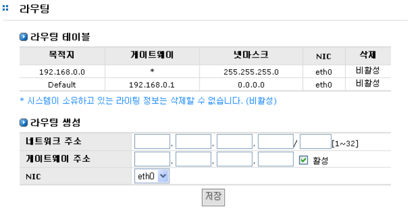
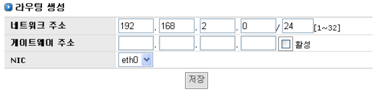
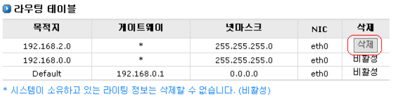

## 4.5 라우팅 테이블 설정

AnyStor NAS는 라이팅 테이블를 제공합니다. 기본 게이트웨이로 접근할 수 없는 인트라 네트워크 환
경에서 유용하게 사용하실 수 있습니다. ( [그림 4.5.1] 참조 )

  
[ 그림 4.5.1 라우팅 테이블 설정 화면 ]

###4.5.1 라우팅 테이블의 설정

① 라우팅 테이블에 추가할 네트워크 주소를 입력합니다.

② 특정 게이트웨이가 필요하다면 IP 입력 후 “활성”을 선택합니다.

③ 해당 네트워크 주소가 라우팅될 NIC를 선택합니다.

  
[ 그림 4.5.2 라우팅 테이블 정보 설정 ]

 
④ **저장** 버튼을 클릭하여 설정 정보를 저장합니다.

⑤ [그림 4.5.2]과 같이 정보가 설정됩니다.

### 4.5.2 라우팅 테이블의 삭제

[그림 4.5.3]에서 해당 항목의 삭제버튼을 클릭하여 항목을 삭제합니다

  
[ 그림 4.5.3 라우팅 테이블]

 