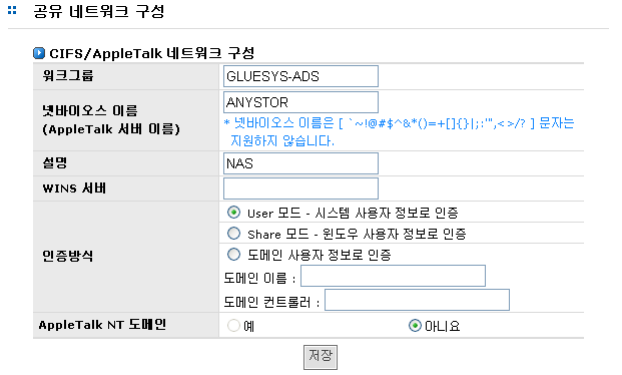

## 4.3 공유 네트워크 구성

  
[ 그림 4.3.1 CIFS 네트워크 설정 ]

*  워크그룹 : 워크그룹을 입력한다.
*  넷바이오스 이름 : AnyStor NAS의 이름을 입력합니다.(도메인 사용자 정보로 인증시 넷바이오스이름과 시스템 호스트명이 일치하여야 합니다.)
*  설명 : 간단한 설명 정도를 넣을 수 있으며 옵션 기능입니다.
*  WINS 서버 : WINS 서버를 사용할 경우 WINS 서버를 입력합니다.
*  인증 방식 : 인증 방법은 AnyStor NAS를 사용할 수 있는 계정을 설정하는 부분입니다. 즉 AnyStor에서 계정메뉴를 통해 직접 계정을 만들어 줄 수도 있고, 기존에 PDC나 원격 NT서버에서 사용하던 계정
을 가지고 인증을 제공해 줄 수도 있습니다.

>	A. User 모드 - 시스템 사용자 정보로 인증 : AnyStor에서 계정 메뉴를 통해 등록한 로컬 사
용자와 그룹에 대한 계정을 가지고 인증하는 방식

>	B. Shared 모드 – 윈도우 사용자 정보로 인증 : 모든 사용자의 공유 디렉터리 접근을 허용하
는 방식

>	C. 도메인 사용자 정보로 인증 : ADS를 이용한 공유방식으로서 ADS의 해당 도메인 컨트롤
러에 등록된 사용자 계정을 통해 인증하는 방식입니다. 즉 ADS의 도메인 컨트롤러에 등
록된 사용자 만이 AnyStor NAS에 접근이 가능합니다.

*  AppleTalk NT 도메인 : 도메인 사용자 정보로 AppleTalk을 인증한다. 단, 위 **“인증 방식”**이 **“도메인사용자 정보로 인증”** 모드일 때 **“예”** 선택이 가능하다.

