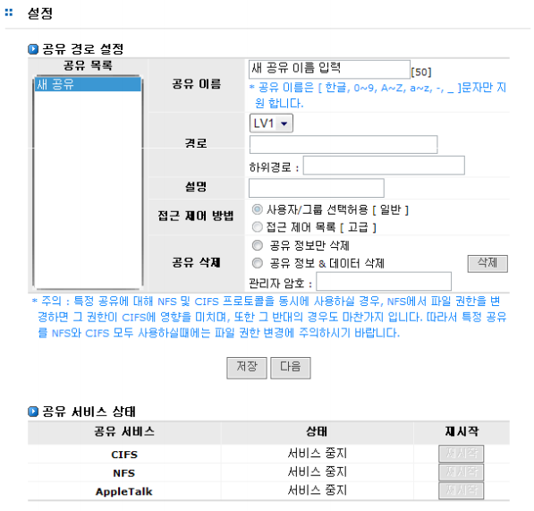

#  6 공유 관리

## 6.1 공유 관리 개요

AnyStor NAS 는 CIFS, NFS 및 AppleTalk을 이용한 데이타 공유를 지원합니다. 따라서 윈도우, 리눅스
, 매킨토시 사용자들이 볼륨이나 디렉터리를 공유할 수 있습니다. AnyStor NAS는 볼륨 및 디렉토리 기
반의 데이터 공유를 제공하며, 이후부터는 볼륨과 디렉터리를 특별히 구분하여 설명하지 않는 한 볼륨
으로 통칭하여 사용하도록 하겠습니다.
  
[그림 6.1]은 데이터 공유 설정 화면입니다.

 
[ 그림 6.1.1 AnyManager의 공유 설정 ]

