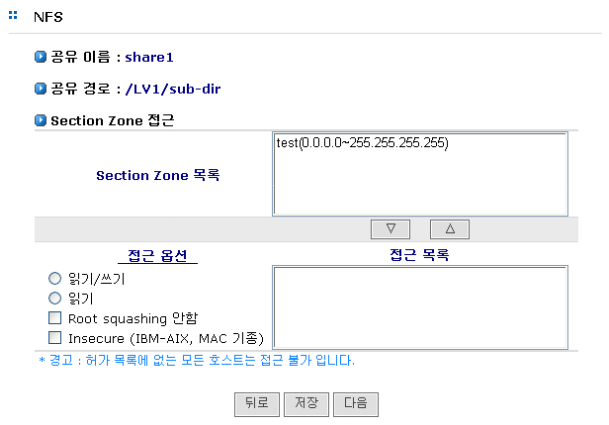

## 6.4 NFS 설정(NFS)

NFS는 Unix 계열 시스템간의 데이터의 공유를 제공하는 프로토콜입니다. AnyStor NAS는 Unix 플랫폼
시스템이 NAS 스토리지를 활용할 수 있도록 NFS 프로토콜을 지원합니다. NFS 설정에서는 [공유]-[설정] 메뉴에서 설정한 공유 목록에 대한 접근 권한을 제어합니다. NFS는 접근 그룹 및 사용자에 대한 접근
제어는 제공하지 않습니다.
  
[그림 6.4]는 NFS 설정 관리를 위한 웹 GUI 이며, 데이터의 공유를 위해 공유 목록으로 설정된 **“/LV1”** 볼륨에 대한 접근 권한을 제어하는 예를 보여줍니다.

 
[ 그림 6.4 NFS 설정 관리 ]

### 6.4.1 공유 경로

NFS 클라이언트가 마운트할 마운트 지점

### 6.4.2 Section Zone 접근

>	A. 해당 Share에 대한 전체적인 접근 권한을 제어하는 항목입니다.

>	B. 왼편의 **‘Section Zone 접근’**에 있는 Section Zone을 등록하여 사용하실 수 있습니다.

>	C. 해당 볼륨에 대한 접근 권한을 선택합니다. 접근 권한은 다음과 같이 제어됩니다.

>	>	a. 읽기 전용 : 해당 디렉터리에 대한 읽기 권한만 허용

>	>	b. 읽기/쓰기 : 해당 디렉터리에 대한 읽기/쓰기 권한 허용

>	>	c. Root squashing 안함 : 해당 디렉터리(볼륨)을 NFS 클라이언트의 루트 파일 시
스템으로 마운트를 시킬 수 있도록 권한 설정

>	>	d. Insecure : IBM-AIX, MAC 사용자를 위한 모드

### 6.4.3  NFS Client 접속 시 주의사항

클라이언트가 memory map을 사용하는 경우 다음의 문제가 발생할 수 있습니다.

>	A. 파일 내용의 업데이트가 느린 경우 발생

>	B. .nfsxxx 파일 생성 (close call을 사용하지 않는 경우)

>	C. CIFS 기본 지원 문자코드는 UTF-8입니다. CIFS와 NFS를 동시 공유하여 사용 시 NFS 클
라이언트에서 UTF-8을 지원하지 않을 경우 한글(영어가 아닌 문자)는 비정상으로 보입니
다. UTF-8 외 다른 문자 코드 지원이 필요한 경우 기술지원에 문의하시기 바랍니다.

>	D. 솔라리스9에서 NFS 마운트 시 오라클 테이블 공간으로 사용할 경우 다음과 같은 옵션을
추가하셔야 합니다.

>	>	a. rw, bg, hard, timeo=600, rsize=32678, wsize=32678

>	>	b. 기타 솔라리스 버전에서는 tcp, nfsver=3 옵션이 필요할 수도 있습니다.
