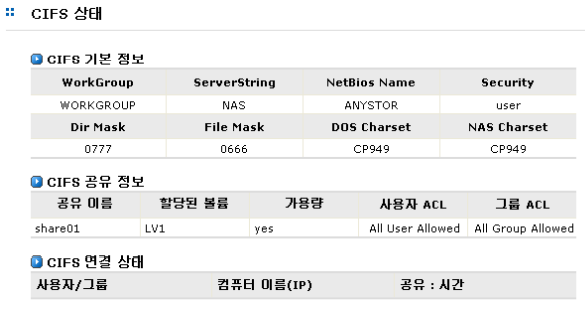
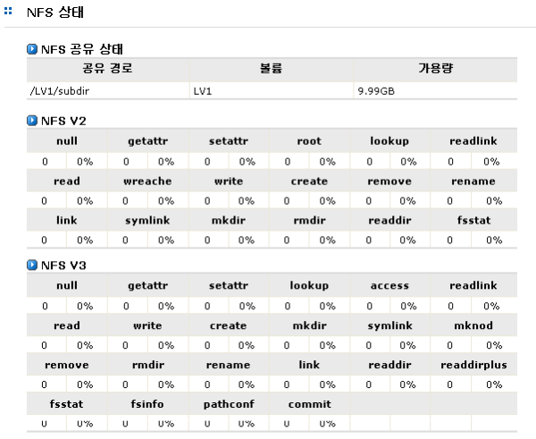
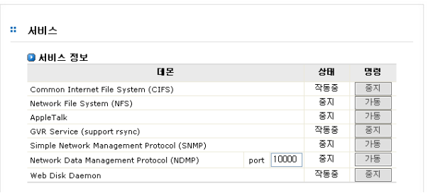

## 6.7 CIFS 및 NFS 서비스의 상태 관리

### 6.7.1 CIFS 서비스의 상태

CIFS의 서비스 상태는 [시스템 정보]-[CIFS 상태] 메뉴에서 확인할 수 있습니다. [그림 6.7.1]는 CIFS 서
비스의 상태 정보를 표시하는 예입니다.

 
[ 그림 6.7.1 CIFS 서비스 상태 정보 ]

### 6.7.2 NFS 서비스의 상태

NFS의 상태는 [시스템 정보]-[NFS 상태] 메뉴에서 확인할 수 있습니다.

[그림 6.7.2]는 NFS 서비스의 상태 정보를 표시하는 예입니다. 표시되는 정보는 NFS V2, V3에 대한 상
태 정보 입니다.

 
[ 그림 6.7.2 NFS 서비스 상태 정보]

### 6.7.3 CIFS 및 NFS 데몬 관리

CIFS 및 NFS 데몬의 관리는 [시스템]-[서비스] 메뉴에서 수행할 수 있습니다.
 
[그림 6.7.3]은 데몬 서비스의 동작을 관리하기 위한 인터페이스입니다. 이를 이용하여 사용자는 현재
데몬의 상태 정보를 볼 수 있으며, 데몬의 동작 여부를 관리할 수 있습니다. (세부 내용은 [시스템] 메뉴참조)

 
[ 그림 6.7.2서비스 상태 정보]
