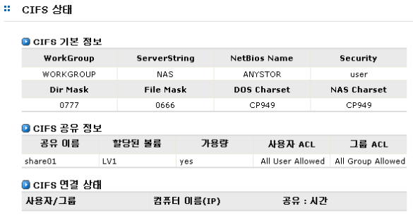
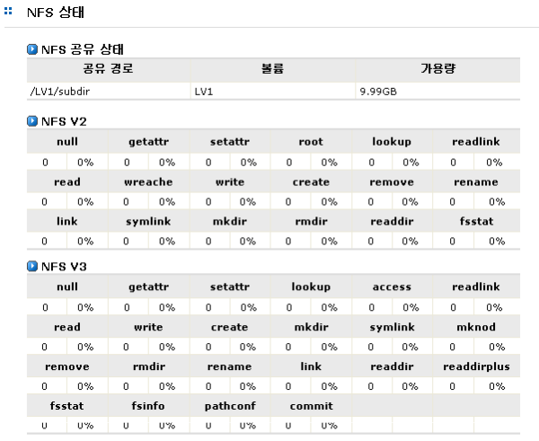

## 6.6 CIFS 및 NFS 서비스의 활용

### 6.6.1  CIFS 서비스의 활용

CIFS 서비스를 활용하여 데이터를 공유하거나 스토리지를 활용하기 위해서 다음과 같은 절차에 따라 서
비스를 사용할 수 있습니다.

>	① 공유하고 싶은 논리볼륨을 생성합니다. [LVM]

>	② 인증방법을 선택합니다. [네트워크]

>	③ 로컬 사용자를 이용한 인증방식을 사용할 경우 사용자와 그룹을 설정해 줍니다. [계정]

>	④ 공유 볼륨을 설정하고 CIFS 공유 세부 내용을 설정합니다. [공유]-[설정]-[CIFS]

>	⑤ Windows 클라이언트에서 NAS의 공유 디렉토리로 접근합니다. [그림 6.6.1]은 **‘192.168.0.109’**로 IP주소가 설정되어 있는 NAS 시스템을 접근하기 위하여 Windows 실행창에서
접근 명령을 입력한 예입니다.

 
[ 그림 6.6.1 CIFS 서비스를 이용한 NAS 접근 ]

>	⑥ 공유 목록 및 CIFS 설정이 정상적으로 수행된 경우 [그림 6.6.2]와 같이 공유된 디렉터리
들을 볼 수 있습니다. 단, 접근을 시도하는 Windows 클라이언트가 “접근 불가” 리스트에
들어있을 경우 접근할 수 없습니다.

 
[ 그림 6.6.2 CIFS 서비스를 이용한 NAS 접근 ]

>	⑦ 공유된 각각의 디렉터리들은 접근 권한에 따라 Windows 클라이언트가 접근할 수 있습
니다. 모든 사용자에게 접근이 허가된 경우는 별도의 사용자 인증 과정 없이 해당 디렉터
리에 접근할 수 있으나, 일반적인 경우 디렉터리에 접근하기 위해서는 인증 과정을 거칩
니다. 인증 시에는 등록된 ID와 패스워드를 필요하며 PDC 서버로 인증하는 경우에는 PD
C 서버에 등록되어 있는 ID와 패스워드를 사용하여 접근이 가능합니다.

>	⑧ 필요에 따라 각 공유 디렉터리를 네트워크 드라이브로 설정할 수 있습니다.

### 6.6.2 NFS 서비스의 활용

NFS 서비스를 활용하여 데이터를 공유하거나 스토리지를 활용하기 위해서 다음과 같은 절차를 따라 서
비스를 사용할 수 있습니다.

>	A. 공유하고 싶은 논리볼륨을 생성합니다. [LVM]

>	B. 서비스 대상이 되는 Secure Zone를 설정합니다. [네트워크]-[보안]

>	C. 공유 볼륨을 설정하고 NFS에서 전체 접근 권한 및 호스트별 접근 권한을 설정합니다. [공유]-[설정]-[NFS]

>	D. 접근 권한이 주어진 Unix 계열 호스트에서 공유 디렉토리를 NFS 서비스를 이용하여 마
운트를 수행합니다. [그림 6.6.3]은 NFS 서비스를 이용하여 **‘/testVol1/share1’** 디렉토리
를 클라이언트 호스트에 마운트한 예를 보여주고 있습니다.

 
[ 그림 6.6.3 NFS 서비스를 이용한 공유된 디렉토리 접근 ]

>	 E. 단, 접근을 시도하는 클라이언트 호스트가 **‘접근 불가’** 리스트에 들어있을 경우 접근할
수 없으며, 클라이언트 호스트에 마운트된 공유 목록은 설정된 권한에 따라 읽기 전용 또
는 읽기/쓰기 등의 권한으로 사용될 수 있습니다.

## 6.7 CIFS 및 NFS 서비스의 상태 관리

### 6.7.1 CIFS 서비스의 상태

CIFS의 서비스 상태는 [시스템 정보]-[CIFS 상태] 메뉴에서 확인할 수 있습니다. [그림 6.7.1]는 CIFS 서
비스의 상태 정보를 표시하는 예입니다.

 
[ 그림 6.7.1 CIFS 서비스 상태 정보 ]

### 6.7.2 NFS 서비스의 상태

NFS의 상태는 [시스템 정보]-[NFS 상태] 메뉴에서 확인할 수 있습니다.

[그림 6.7.2]는 NFS 서비스의 상태 정보를 표시하는 예입니다. 표시되는 정보는 NFS V2, V3에 대한 상
태 정보 입니다.

 
[ 그림 6.7.2 NFS 서비스 상태 정보]

### 6.7.3 CIFS 및 NFS 데몬 관리

CIFS 및 NFS 데몬의 관리는 [시스템]-[서비스] 메뉴에서 수행할 수 있습니다.
 
[그림 6.7.3]은 데몬 서비스의 동작을 관리하기 위한 인터페이스입니다. 이를 이용하여 사용자는 현재
데몬의 상태 정보를 볼 수 있으며, 데몬의 동작 여부를 관리할 수 있습니다. (세부 내용은 [시스템] 메뉴참조)

 
[ 그림 6.7.2서비스 상태 정보]
