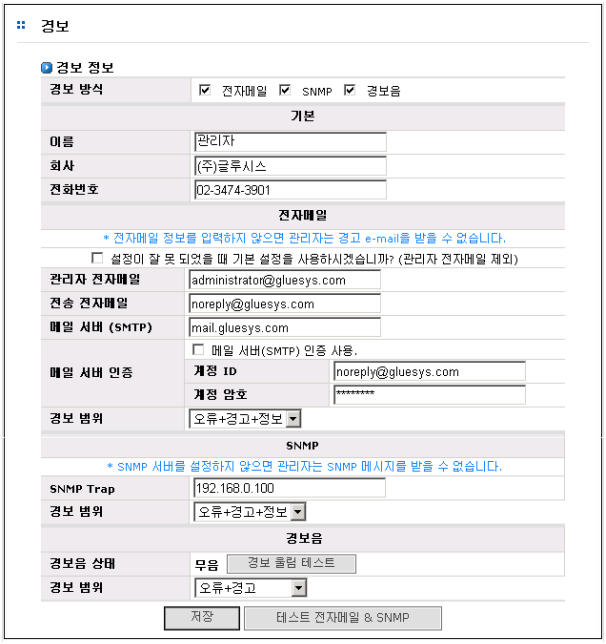
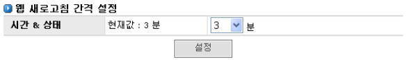

## 7.2 경보

시스템의 이상 발생시 E-Mail, SNMP 트랩 메시지, 알람을 통하여 시스템 관리자에게 알려줄 수 있
도록 하는데 필요한 데이터를 입력하는 인터페이스를 제공하며, 또한 관리자가 웹 작업 시 화면 갱신
시간을 설정할 수 있게 함으로서 웹에서의 작업을 용이하게 할 수 있습니다.

### 7.2.1 경보 정보 설정

* 기본 : 관리자의 이름, 회사 이름, 전화번호
* 전자메일
  * 설정이 잘못 되었을 때 기본 설정을 사용하시겠습니까? : 메일 설정이 잘못
되었을 시 시스템에서 디폴트로 설정되어 있는 메일 설정을 사용
  * 관리자 전자메일 : 전자메일을 받고자 하는 메일 주소
  * 전송 전자 메일 : 전자메일을 보내는데 사용하는 메일 계정
  * 메일 서버(SMTP) : 전자메일을 보내는데 사용하는 SMTP 서버
  * 메일 서버 인증 : SMTP 인증을 사용할지 여부
     * 계정 ID : SMTP 인증이 사용되는 계정 ID
     * 계정 암호 : SMTP 인증에 사용되는 계정 패스워드
  * 경보 범위 : 발생한 상태의 종류(레벨)에 따라 경보 사용 여부를 결정
     * 오류 : 오류에 해당하는 상태 발생 시
     * 오류+경고 : 오류 미 경고에 해당하는 상태 발생 시
     * 오류+경고+정보 : 오류 및 경고, 정보에 해당하는 상태 발생 시
* SNMP
  * SNMP 트랩 메시지를 받을 IP 주소
  * 경보 범위 : 발생한 상태의 종류(레벨)에 따라 경보 사용 여부를 결정
     * 오류 : 오류에 해당하는 상태 발생 시
     * 오류+경고 : 오류 미 경고에 해당하는 상태 발생 시
     * 오류+경고+정보 : 오류 및 경고, 정보에 해당하는 상태 발생 시
* 경보음
  * 경보음 상태 : 경보음의 울림여부를 알려주고 울림을 중지시키거나 경보음을
테스트해 보실 수 있습니다.
  * 경보 범위 : 발생한 상태의 종류(레벨)에 따라 경보 사용 여부를 결정
     * 오류 : 오류에 해당하는 상태 발생 시
     * 오류+경고 : 오류 미 경고에 해당하는 상태 발생 시
     * 오류+경고+정보 : 오류 및 경고, 정보에 해당하는 상태 발생 시
*  **“테스트 전자메일 & SNMP”** 버튼을 누르면 테스트 이메일과 SNMP 트랩 메시지가 발
송됩니다. 만약 값을 입력한 뒤 **“저장”**을 누르지 않고 **“테스트 전자메일 & SNMP”** 버튼
을 누를 경우 메일이 전송되지 않으며 기본 게이트웨이 및 DNS가 설정되지 않았을 경
우에도 메일이 전송되지 않습니다.

* **“저장”** 버튼을 누르면 기입한 정보가 저장이 되며, 수정 시에 사용할 수도 있습니다.

 
[ 그림 7.2.1 경고를 위한 경보 설정 ]

### 7.2.2 웹 새로고침 간격 설정

>	A. [시스템]-[시간]과 [시스템 정보] 메뉴의 웹 GUI 새로 고침 간격은 **“시간 & 상태”** 항목
에서 세팅할 수 있습니다.

>	B. HA와 같이 관리작업의 완료에 시간이 많이 소요되는 항목에서는 별도의 웹 GUI 갱신
시간을 사용하므로 본 항목의 설정값에 적용이 안될 수도 있습니다.

 
[ 그림 7.2.2 웹 새로고침 간격 설정]