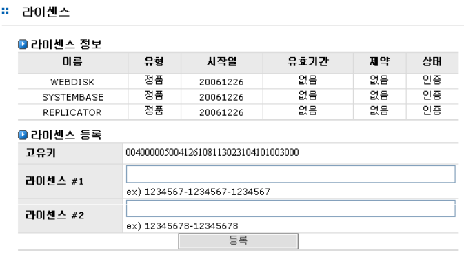
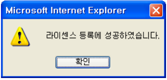

## 7.7 라이센스

시스템의 라이센스를 관리하기 위한 인터페이스 입니다. 라이센스 발급이 필요한 모듈에 라이센스
등록을 할 수 있습니다.
 
[그림 7.7]는 AnyStor 기본 라이센스와 AnyReplicator, 웹 디스크 라이센스를 등록한 화면 입니다..

 
[그림 7.7  라이센스 관리 ]

### 7.7.1 라이센스 등록

>	① 라이센스 번호를 입력합니다. 라이센스 번호는 제품 구입 시, 또는 새로운 모듈 구입 시발급 됩니다.

>	② **‘등록’**버튼을 클릭하여 라이센스 번호를 등록합니다.

>	③ 등록에 성공하면 [그림 7.7.1]과 같은 메시지가 출력됩니다.

 
[그림 7.7.1  라이센스 등록 성공 ]

