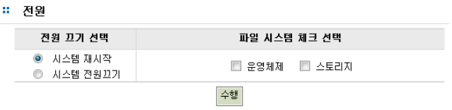

## 7.8 전원

시스템의 종료 및 부팅을 관리하기 위한 인터페이스 입니다. 시스템 종료 및 부팅을 위한 옵션은 다
음과 같습니다. 

* 전원 끄기 선택
   * 시스템 재시작 : 시스템 리부팅
   * 시스템 전원끄기 : 시스템 셧다운
* 파일 시스템 체크 선택
   * 운영체제 : 시스템 리부팅 시 운영체제 파일 시스템 체크
   * 스토리지 : 시스템 리부팅 시 선택한 스토리지 볼륨 파일 시스템 체크

 
[그림 7.8.1   시스템 전원 ]

 
[그림 7.8.2  라이센스 등록 성공 ]

+	**※ NOTE**
	부팅중 파일 시스템 체크는 디스크 용량에 따라 많은 시간이 걸릴 수도 있습니다. 특히 스토리지 파일 시스템의 체크는 꼭 필요한 경우에만 수행하십시요.

 