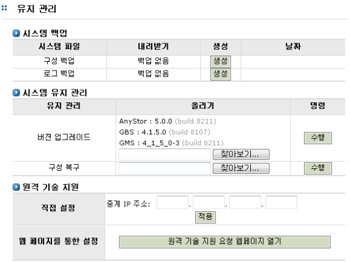
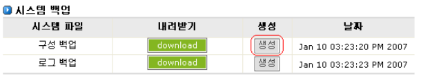
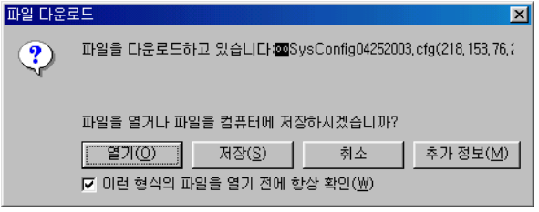
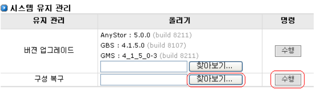
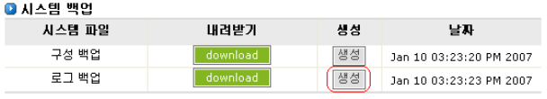
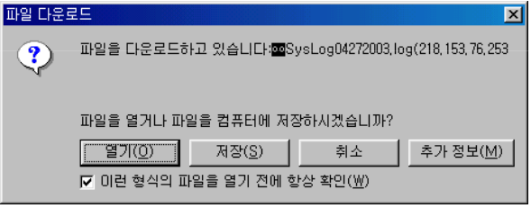
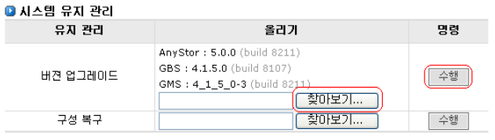
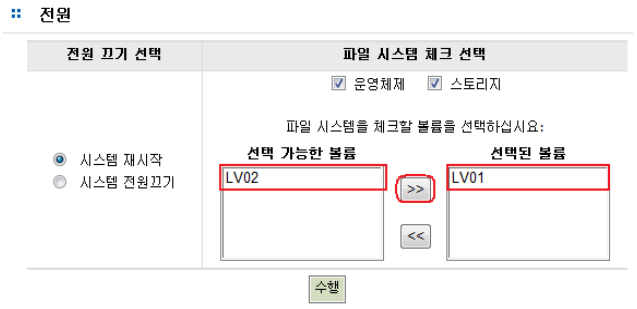

## 7.6 유지관리

시스템의 유지 보수를 위한 메뉴입니다. 시스템의 유지 보수는 시스템 설정 파일의 백업 및 복구,
시스템 로그 백업, 시스템 온라인 업그레이드 기능을 포함합니다.

 
[ 그림 7.6 시스템 유지관리 화면 ]

### 7.6.1 시스템 설정 파일 백업

시스템에 이상이 발생할 경우 시스템을 원상태로 복귀시키기 위해서는 기존의 시스템 설정 파일들이
필요합니다. AnyStor NAS는 시스템 설정 파일 백업 기능을 제공하여 시스템에 이상이 발생하여도 예
전 시스템 설정을 처음부터 다시 수행하지 않고 간단히 원래의 설정을 복구할 수 있도록 하는 기능을
제공합니다. 단 시스템의 안정성 문제때문에 볼륨정보는 백업하지 않습니다. 결국 시스템 설정 정보를
복구해도 그 당시에 설정되어 있는 볼륨정보는 변경하지 않게 됩니다.
  
시스템 설정 파일 백업은 다음과 같은 순서로 수행합니다.
  

 
[ 그림 7.6.1 시스템 설정 파일 백업(파일 생성) ]

>	A. **“생성”** 버튼을 클릭하면 위와 같이 생성된 날짜가 표시되며 **“download”** 이라는 버튼이
생깁니다.

>	B. **“download”**을 클릭하면 파일을 열거나 저장할 수 있는 메시지가 출력됩니다. 파일이름
은 **‘SysConfig월-일-년도.cfg’** 로 구성되어 있습니다.

 
[ 그림 7.6.2 시스템 설정 파일 저장 ]

### 7.6.2 시스템 설정 구성 복구

시스템에 이상이 발생한 경우 백업된 시스템 설정 파일을 이용하여 시스템을 원상태로 복구 시킬 수
있습니다. 시스템을 원래대로 복구 시키기 위해서는 다음 과정을 수행합니다.

 
[ 그림 7.6.3 시스템 설정 파일 복구 ]

>	A. [시스템]-[유지관리] 메뉴로 이동합니다.

>	B. **“시스템 유지관리”** 항목에서 **“구성 복구”**에 해당하는 **“찾아보기”** 버튼을 클릭합니다. 파
일 검색 창에서 기존에 백업 되어있는 시스템 설정 파일의 최신 본을 선택하고 확인 버
튼을 클릭합니다.

>	C. **“수행”** 버튼을 클릭하여 시스템 설정파일 복구를 수행합니다.

### 7.6.3시스템 로그파일 백업

 
[ 그림 7.6.4 로그파일 백업 ]

>	A. 로그 백업의 **“생성”** 버튼을 클릭하여 로그 파일을 생성하면 위와 같이 생성날짜와 **“download”**라는 버튼이 생깁니다.

>	B. **“download”**을 클릭하면 파일을 열거나 저장할 수 있는 메시지가 출력됩니다. 파일이름은 **‘Sys로그월-일-년도.AnyStorLog’** 로 구성되어 있습니다.

 
[ 그림 7.6.5 로그 백업파일 저장 ]

### 7.6.4 시스템 업그레이드

AnyStor NAS는 온라인 업그레이드 기능을 제공합니다. 새로운 업그레이드 파일을 이용하여 시스템의
업그레이드를 수행할 수 있습니다. 업그레이드를 수행하는 순서는 다음과 같습니다.

>	① 업그레이드 파일을 구합니다(웹에서 다운로드 받거나, CD롬으로 배포 예정)

>	② **“버전 업그레이드”** 항목에서 “찾아보기” 버튼을 클릭하여 해당 업그레이드 파일을 선택합니다.

>	③ **“수행”** 버튼을 클릭하여 시스템 업그레이드를 수행합니다.

 
[ 그림 7.6.6 시스템 업그레이드 ]

+	**※ NOTE**
	업그레이드 기능의 종류에 따라 시스템 리부팅을 필요로 할 수 있습니다. 시스템을 리부팅 해야 할 경우 반
	드시 현재 수행되고 있는 서비스를 확인 후 리부팅을 수행하십시오.

## 7.7 라이센스

시스템의 라이센스를 관리하기 위한 인터페이스 입니다. 라이센스 발급이 필요한 모듈에 라이센스
등록을 할 수 있습니다.
 
[그림 7.7]는 AnyStor 기본 라이센스와 AnyReplicator, 웹 디스크 라이센스를 등록한 화면 입니다..

 
[그림 7.7  라이센스 관리 ]

### 7.7.1 라이센스 등록

>	① 라이센스 번호를 입력합니다. 라이센스 번호는 제품 구입 시, 또는 새로운 모듈 구입 시발급 됩니다.

>	② **‘등록’**버튼을 클릭하여 라이센스 번호를 등록합니다.

>	③ 등록에 성공하면 [그림 7.7.1]과 같은 메시지가 출력됩니다.

 
[그림 7.7.1  라이센스 등록 성공 ]

## 7.8 전원

시스템의 종료 및 부팅을 관리하기 위한 인터페이스 입니다. 시스템 종료 및 부팅을 위한 옵션은 다
음과 같습니다. 

* 전원 끄기 선택
   * 시스템 재시작 : 시스템 리부팅
   * 시스템 전원끄기 : 시스템 셧다운
* 파일 시스템 체크 선택
   * 운영체제 : 시스템 리부팅 시 운영체제 파일 시스템 체크
   * 스토리지 : 시스템 리부팅 시 선택한 스토리지 볼륨 파일 시스템 체크

 
[그림 7.8.1   시스템 전원 ]

 
[그림 7.8.2  라이센스 등록 성공 ]

+	**※ NOTE**
	부팅중 파일 시스템 체크는 디스크 용량에 따라 많은 시간이 걸릴 수도 있습니다. 특히 스토리지 파일 시스템의 체크는 꼭 필요한 경우에만 수행하십시요.

 