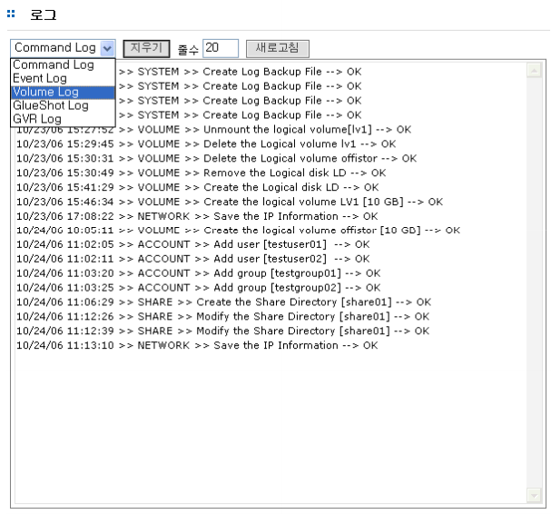

## 7.3 로그

시스템에서 발생하는 모든 로그에 대한 관리를 수행합니다. 시스템에서 관리되는 로그의 종류는 히
스토리 로그, 메시지 로그, 삼바 로그, 아파치 로그, 부트 로그, 크론 로그, 보안 로그 및 메일 로그를 제
공합니다. 필요한 경우 로그 뷰를 통하여 각 로그를 볼 수 있습니다. [그림 7.3]는 로그 관리 및 뷰를
제공하는 GUI입니다.  

 
[ 그림 7.3 로그 관리 및 뷰 ]

  
로그 관리 및 뷰는 [시스템]-[로그] 메뉴에서 수행합니다. 시스템 로그를 보기 위해서는 우선 해당하는
로그를 선택합니다.

>	A. 로그를 선택하면 해당 로그가 뷰 화면에 출력됩니다.
>	B. 로그를 지우려면 **“지우기” **버튼을 클릭하십시오.

+	**※ NOTE**
	시스템의 비정상적인 동작을 방지하기 위하여 로그는 일정 크기 이상이 되면 자동으로 삭제됩니다. 따라서
	시스템 관리자가 로그를 유지하고 싶을 경우 로그를 주기적으로 백업 받아야 합니다. 로그에 대한 백업은 [유지보수(유지관리)] 메뉴에서 수행이 가능합니다. 
	(세부 내용은 [7.6 시스템 유지관리](#76-유지관리) 메뉴 참조)
