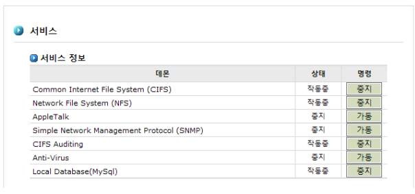

## 7.5 서비스

서비스 데몬에 대한 관리를 수행하기 위한 인터페이스 입니다. 데몬의 현재 상태를 볼 수 있으며,
데몬의 구동 및 종료를 관리합니다. 관리 대상이 되는 서비스의 종류는 다음과 같습니다.

>	A. CIFS / NFS / AppleTalk 서비스 데몬의 구동 및 종료

>	B. SNMP 서비스 데몬의 구동 및 종료

>	C. CIFS Auditing 서비스 데몬의 구동 및 종료 **(CIFS 로그기록 기능 설치시 활성화)**

>	D. Anti-Virus 서비스 데몬의 구동 및 종료 **(Anti-Virus 기능 설치시 활성화)**

>	E. Local Databases(MySql) 서비스 데몬의 구동 및 종료

 
[ 그림 7.5 서비스 데몬 설정 ]