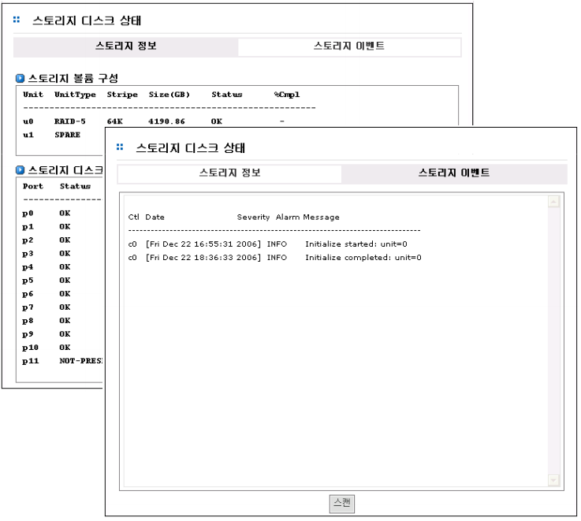
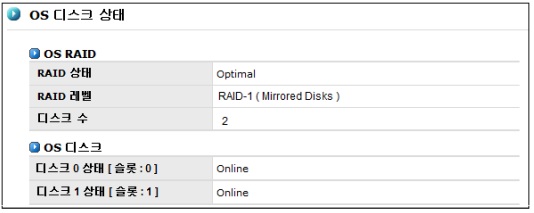

## 2.4 디스크 상태

### 2.4.1 스토리지 디스크 상태 (AnyStor 500series에만 해당됨)

AnyStor 500 시리즈에서는 스토리지의 전반적인 상태 정보를 보여줍니다. 설정되어 있는 스토리지
볼륨과 디스크의 상태를 포함한 정보와 동작 중 발생한 이벤트를 보여줌으로써 시스템에 문제가 발생할
경우 신속한 대응을 할 수 있도록 지원합니다. 

  
  
&nbsp; &nbsp; [ 그림 2.4.1  스토리지 디스크 상태 정보 ]

### 2.4.2 OS 디스크 상태 (AnyStor 3000/5000/GW에 해당됨)

AnyStor 3000/5000/GW시리즈는 시스템 OS에 대한 신뢰성을 높이고 단일 OS 이미지에 의한 Singlepoint-of-failure를 제거하기 위한 방안으로 OS 디스크 미러링 기능을 제공합니다. 미러링된 OS의 활용
으로 시스템은 무중지 서비스를 수행할 수 있습니다.
  

**[디스크 상태]** 메뉴에서는 미러링된 OS 디스크의 상태를 파악하여 디스크에 이상이 발생할 경우 즉각
공지를 수행하고, OS 디스크를 효율적으로 복구하기 위한 기능을 제공합니다. 또한 첫번째 디스크가 오
류가 나더라도 두번째 디스크 하나로 동작할 수 있도록 제공합니다.

  
  
&nbsp; &nbsp; [ 그림 2.4.2  OS 디스크 상태 ]

+	** OS 디스크를 복구하기 위해서는 우선 OS 디스크의 상태를 파악합니다. OS 디스크의 상태는 [그림 2.4.2]에서와 같이 [디스크 상태] 메뉴에 잘 나타나 있습니다.**
    ** OS 디스크가 정상이 아닐 경우 다음의 과정을 수행합니다. **

	1. 이상이 있는 OS 디스크를 제거합니다.
	2. 새로운 OS 디스크를 삽입합니다.
	3. 새로운 OS 디스크를 삽입하면, 자동으로 복구를 시작합니다.
	4. 복구가 완료되면 두 개의 디스크 모두 ‘online’ 이나 ‘optimal’로 표시됩니다.
	5. 복구되지 않을 경우, 디스크 또는 시스템 하드웨어를 점검한 후 다시 위의 과정을 반복합니다.

