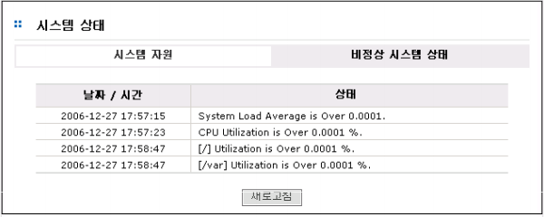

# 2 시스템 정보

## 2.1  시스템 상태

시스템 상태는 CPU, 메모리, 하드웨어(보드 지원 시), 볼륨 상태정보 그리고 시스템 상태가 비정상적
이거나 주의를 할 사항이 있을 시 그것들의 목록을 보여줌으로써 관리자가 시스템의 현재상태를 알기
쉽도록 도와줍니다.

  
[ 그림 2.1 시스템 정보 초기 화면 ]

### 2.1.1 시스템 자원

#### ▶ CPU / Memory

>CPU와 메모리의 사용량을 제공합니다. 각 CPU나 메모리의 BAR에 접근하면 사용량을 수치로 보여줍니
다. CPU와 메모리의 사용량이 정상적인 경우에는 녹색볼이 표시되며 비정상적인 경우에는 황색볼이나
적색볼이 표시됩니다.

>[그림 2.1.1]는 CPU 사용량과 메모리사용량을 보여주는 GUI 입니다. 정확한 사용율을 알고 싶으면 해당
BAR에 마우스를 갖다 대면 아래와 같은 정확한 사용율이 표시됩니다.

>아래 그림은 메모리 BAR에 마우스를 가져갔을 때의 화면입니다.

  
[ 그림 2.1.1  CPU와 Memory 사용량 정보]

#### ▶ 하드웨어
> 하드웨어 상태 정보를 제공합니다. 표시 항목은 각 서버 보드마다 차이가 있을 수 있습니다.각 항목들은
정상적인 경우에는 녹색볼이 표시되며 비정상적인 경우에는 황색볼이나 적색볼이 표시됩니다. 

> [그림 2.1.2]는 하드웨어 상태를 표시하는 예입니다.

  
[ 그림 2.1.2  하드웨어 상태 정보 ]

#### ▶ 볼륨 정보(볼륨)
> 각 볼륨 당 사용량을 제공합니다. 볼륨 사용량이 정상적인 경우에는 녹색볼이 표시되며 비정상적인 경
우에는 황색볼이나 적색볼이 표시됩니다. 

> [그림2.1.3]은 볼륨의 사용량을 표시하는 예입니다

  
[ 그림 2.1.3 볼륨 정보 ]

----

### 2.1.2 비정상 시스템 상태

> NAS의 모니터링 시스템은 비정상적인 시스템 상태가 존재 시 그것들의 목록을 생성, 유지합니다. 다
시 정상적인 상태가 되었을 시는 해당하는 자원의 정보는 목록에서 삭제되므로 현재 비정상적인 시스템
의 자원들의 정보 목록을 보실 수 있습니다.

> [그림 2.1.4]는 강제적으로 비정상적인 시스템 상태를 발생시킨 후 목록의 예입니다

  
[ 그림 2.1.4  비정상 시스템상태 ]