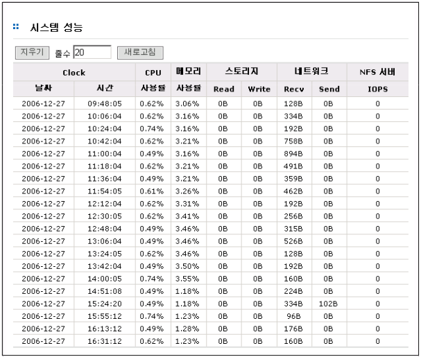
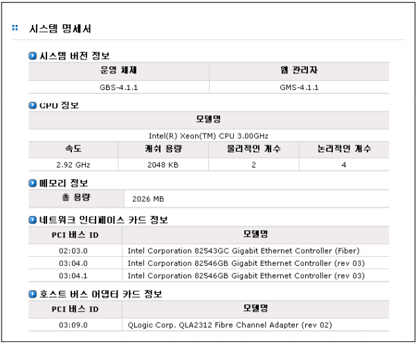

 
## 2.5 시스템 성능

아래에 해당하는 항목들에 대한 NAS 시스템에서 주기적으로 수행되는 성능 모니터링 결과 히스토리
를 보여 줍니다.

*  CPU 사용률
*  메모리 사용률
*  스토리지 I/O ( Read , Write )
*  네트워크 I/O ( Receive , Send )
*  NFS 서버 IOPS (Read + Write)

  
  
[ 그림 2.5.1  시스템 성능 모니터링 결과 히스토리 ]

## 2.6 시스템 명세서

아래에 해당하는 항목들에 대한 시스템 명세서를 보여줍니다.

*  시스템 버전 정보(운영체제, 웹 관리자)
*  CPU 정보(모델명, 속도, 캐쉬 용량, 물리적인 개수, 논리적인 개수)
*  메모리 정보(총 용량)
*  네트워크 인터페이스 카드 정보(PCI 버스 ID, 모델명)
*  호스트 버스 어댑터 카드 정보(PCI 버스 ID, 모델명)
  
  
[ 그림 2.6.1  시스템 명세서 ]

 