## 5.4 AnyShot

AnyShot 기능은 현재 존재하는 논리 볼륨의 한 시점에 대한 이미지 입니다. 이 이미지는 영구적이지
않으며, AnyShot 볼륨 크기, 원본 논리 볼륨에 데이터 변화량에 따라 이미지 보존 기간이 결정됩니다.
단 AnyShot 볼륨 생성 시, 원본 볼륨 크기로 볼륨 크기를 설정 하면 영구 보존이 가능합니다.

 
AnyShot은 크기가 큰 논리 볼륨 백업 시 유용하게 쓰일 수 있습니다. 공유된 논리 볼륨은 지속적인 I/
O가 있기 때문에 백업을 수행하기가 곤란한 경우가 발생합니다. 이러한 논리 볼륨을 AnyShot을 사용하
여 이미지를 만들고, 백업을 수행하면 어느 한 시점에 대한 백업이 가능합니다. 또한 지속적으로 AnySh
ot 볼륨을 생성하여, 사용자 실수나 프로그램 문제로 인한 데이터 손실이 발생할 경우, 최근에 생성한 A
nyShot 볼륨을 복구하거나 파일을 복사하여 문제를 해결할 수 있습니다.

 
AnyShot의 기능은 AnyShot 볼륨 생성, 확장, 삭제, 마운트가 가능하며, 생성에 대한 스케쥴을 등록할
수 있습니다. 또한 논리볼륨을 생성하여 AnyShot 볼륨을 복구하는 기능을 제공합니다. 그리고 원하는
시간(I/O가 거의 없는 시간)에 복구를 수행하여 서비스에 미치는 영향을 최소화할 수 있습니다. 

#### ▶ AnyShot 볼륨 정보

> AnyShot 웹 매니저는 AnyShot 볼륨 정보를 제공합니다. AnyShot 이름과 원본 볼륨 사용량 마운트
정보 및 AnyShot 볼륨 확장, 삭제, 마운트 기능을 제공합니다(그림 5.4.1 참조). 화면에 보이는 볼륨 사
용량은 데이터 사용량이 아닌 물리적 사용량 입니다.
>
> 만약 AnyShot 볼륨이 원본 볼륨의 I/O에 의해 사용량이 100%가 되면 AnyShot 볼륨은 INACTIVE 상태
가 되며, 더 이상 사용이 불가능 합니다. 관리자는 이 점을 항상 유념하여 관리하시기 바랍니다.

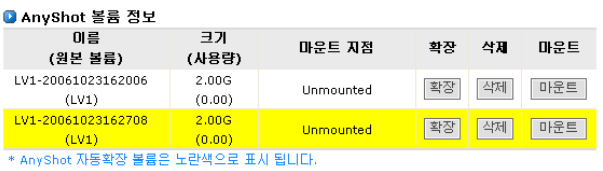  
[ 그림 5.4.1 AnyShot 볼륨 리스트 ]

#### ▶ AnyShot 볼륨 생성

> AnyShot 볼륨을 생성하기 위해서는 원본 볼륨과 볼륨 크기를 지정하여 생성해야 합니다.

> 생성하는 방법은 다음과 같습니다.

① 논리디스크를 선택합니다.(그림 5.4.2 참조)

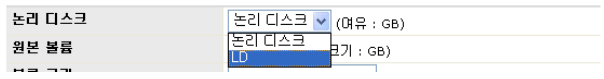  
[ 그림 5.4.2 논리 디스크 선택 ]
  
② 논리 볼륨을 선택합니다.(그림 5.4.3 참조)

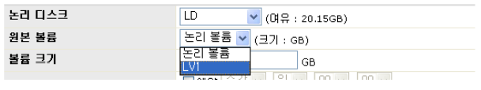  
[ 그림 5.4.3 논리 디스크 선택 ]
  
③ AnyShot 볼륨 크기 입력 합니다. 볼륨 크기는 원본 볼륨 크기의 15% 이상, 100% 이하여
야 합니다. 또한 생성 논리 디스크에 사용 가용량보다 작아야 합니다. 논리 디스크와 논
리 볼륨을 선택하면 입력 가능한 크기가 입력 필드 옆에 표시 됩니다.(그림 5.4.4 참조)

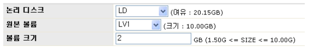  
[ 그림 5.4.4 AnyShot 볼륨 크기 입력]
  
④ AnyShot 볼륨을 지금 생성할 것인지 예약 생성 할것인지 선택하여야 합니다. 지금 생성
을 해야 할 경우는 [그림 5. 3.5]과 같이 **‘지금 수행’** 항목를 선택하여 주십시오.

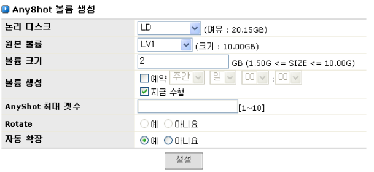  
[ 그림 5.4.5 AnyShot 볼륨 생성 ]
  
⑤ 모든 입력이 끝나면 **생성** 버튼을 클릭하여 AnyShot 볼륨을 생성합니다. AnyShot 볼
륨 이름은 자동으로 생성되며, [그림 5.4.1]과 같이 **[원본볼륨이름]-[날짜][생성시간]** 형
식의 이름을 갖습니다.
주소이전 인터넷
#### ▶ AnyShot 볼륨 예약

> AnyShot 볼륨을 일정 스케줄에 맞추어 예약을 하는 경우는 다음과 같습니다.

① AnyShot 생성 1~3단계 수행

② [그림 5.4.6]와 같이 **V 예약**항목을 선택하고, 일정을 지정합니다. 예약과 동시에
AnyShot 볼륨을 생성할 경우에는 **V 지금수행** 항목도 같이 선택하여 주십시오.

③ 원본 볼륨에 대한 AnyShot 최대 생성 개수와 로테이트 수행 여부를 선택하여 주십시오.

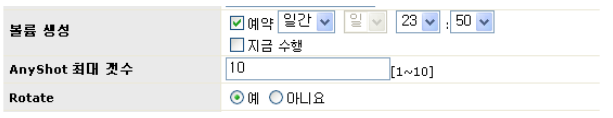  
[ 그림 5.4.6 AnyShot 생성 예약 ]
  
④ 모든 입력이 끝나면 버튼을 클릭하여 AnyShot 볼륨 생성 스케쥴을 등록합니다.
등록 수행 후에는 [그림 5.4.7]와 같이 예약 리스트에 추가된 것을 볼 수 있습니다.

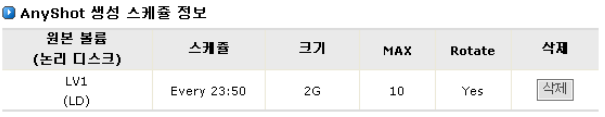  
[ 그림 5.4.7 AnyShot 볼륨 생성 예약 리스트 ]

#### ▶ AnyShot 볼륨 생성 예약 삭제

> AnyShot 볼륨 생성 예약을 삭제하고자 할 때는 AnyShot 볼륨 생성 예약 리스트의 해당 항목에서 **삭제** 버튼을 클릭하십시오.

#### ▶ AnyShot 볼륨 삭제

> AnyShot 볼륨을 삭제 하기 위해서는 AnyShot 볼륨 리스트(그림 5.4.1 참조)의 해당항목에 버
튼을 클릭하시면 [그림 5.4.8]과 같이 삭제 여부를 묻는 대화창이 출력 됩니다. 삭제를 원하실 경우에는
확인 버튼을 클릭하십시오.

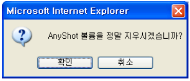  
[ 그림 5.4.8 AnyShot 볼륨 삭제 확인 ]

#### ▶ AnyShot 볼륨 확장

> AnyShot 볼륨 사용량이 100%가 되어서 더 이상 사용이 불가능해 지는 것을 막기 위해 원본 볼륨 크기(
생성 당시)까지 확장이 가능합니다.
> AnyShot 볼륨을 확장 단계는 다음과 같습니다.

① AnyShot 볼륨 리스트(그림 5.4.9 참조)의 해당항목에 **확장** 버튼을 클릭하십시오.

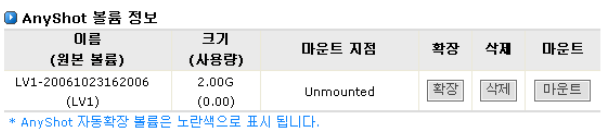  
[ 그림 5.4.9 AnyShot 볼륨 확장 전 ]

  
② [그림 5.4.10]와 같이 확장 크기를 입력 받는 대화창이 출력됩니다. 확장 사이즈를 입력
후 확인 버튼을 클릭하십시오.

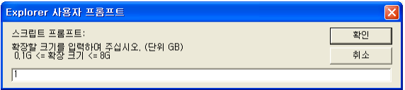  
[ 그림 5.4.10 AnyShot 볼륨 확장 크기 입력  ]

 
③ 확장 후에는 [그림 5.4.11]과 같이 볼륨 크기가 확장 되었음을 볼 수 있습니다.

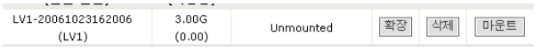  
[ 그림 5.4.11 AnyShot 볼륨 확장 후 ]

#### ▶ AnyShot 볼륨 마운트

> AnyShot 볼륨을 공유하여 사용하기 위해서는 볼륨 마운트가 선행 되어야 합니다. AnyShot 볼륨을 마운
트 하는 단계는 다음과 같습니다.

① AnyShot 볼륨 리스트(그림 5.4.1 참조)의 해당 항목에 버튼을 클릭하십시오.

② [그림 5.4.12]과 같이 디렉토리 입력 대화창이 출력됩니다. 원하는 마운트 디렉토리 이름
을 입력하고 확인 버튼을 클릭합니다.

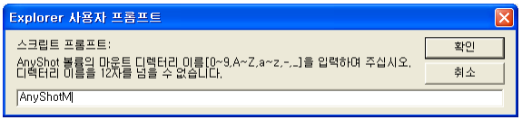  
[ 그림 5.4.12 AnyShot 볼륨 마운트 이름 입력 ]

 
③ 수행 후 [그림 5.4.13]와 같이 마운트가 되었음을 확인할 수 있습니다

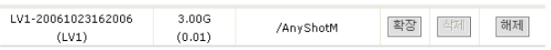  
[ 그림 5.4.13 AnyShot 볼륨 마운트 후 ]

#### ▶ AnyShot 볼륨 복구

>AnyShot은 AnyShot 볼륨 데이터 복구하는 기능을 제공합니다. AnyShot 볼륨 데이터를 단순히 읽기 위
해서는 AnyShot 볼륨 자체를 공유하여 사용하면 되지만, 데이터를 복구하여 읽기/쓰기가 가능하게 하
려면 AnyShot 볼륨을 논리 볼륨에 복제해야 합니다. AnyShot 복구 기능을 새로운 논리 볼륨을 생성하
여 AnyShot 볼륨 데이터를 복구 합니다.

> AnyShot은 복구를 위해 [그림 5.4.14]과 같은 관리 화면을 제공합니다. 복구 절차는 다음과 같습니다.

  
[ 그림 5.4.14 AnyShot 볼륨 복구 ]

 
① AnyShot 볼륨을 선택합니다.(그림 5.4.15 참조)

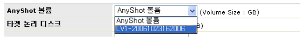  
[ 그림 5.4.15 AnyShot 볼륨 선택 ]
  
② 복구될 논리 볼륨을 생성할 논리 디스크를 선택합니다 (그림 5.4.16 참조)

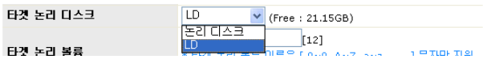  
[ 그림 5.4.16 AnyShot 논리 디스크 선택 ]

 
③ 복구될 논리 볼륨의 이름을 입력합니다.(그림 5.4.17 참조)

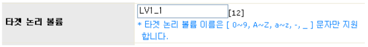  
[ 그림 5.4.17 AnyShot 논리 볼륨 이름 입력 ]

 
④ 복구될 논리 볼륨의 크기를 입력합니다. [그림 5.4.18]과 같이 원본 볼륨 크기(생성 당시)
또는 그 볼륨의 사용량만큼 크기를 생성할 것인지 선택 할 수 있습니다. 복구 후 사용 용
도에 따라 생성 하시면 됩니다. 생성 후에 논리 볼륨 관리자에서 크기 확장이 가능합니다.

  
[ 그림 5.4.18 AnyShot 논리 디스크 크기 선택 ]

 
⑤ 지금 복구할 것인지 복구할 시점을 예약할 것인지 선택하십시오. 지금 바로 복구를 수행
하여야 한다면, [그림 5.4.19]와 같이 **‘지금 수행’** 항목을 선택하십시오.

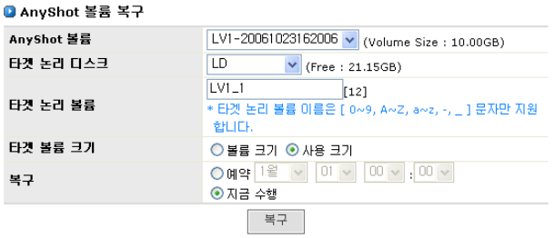  
[ 그림 5.4.19 AnyShot복구 시점 예약 ]

 
⑥ [그림 5.4.19] 와 같이 모든 항목에 대한 입력이 끝났으면, **복구** 버튼을 클릭하여 복
구를 수행해 주십시오.

#### ▶ AnyShot 볼륨 복구 예약

> AnyShot은 복구 시점을 선택하여 복구를 수행할 수 있습니다. AnyShot 볼륨 복구 절차는 다음과 같습
니다.

① AnyShot 볼륨 복구 1단계에서 4단계를 수행합니다.

② [그림 5.4.20] 와 같이 **예약** 항목을 선택합니다.

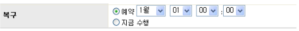  
[ 그림 5.4.20 AnyShot 볼륨 복구 예약 선택 ]

 
③ [그림 5.4.21] 과 같이 모든 항목에 대한 입력이 끝났으면,  **복구** 버튼을 클릭하여 스케
쥴을 등록합니다.

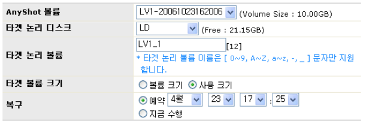  
[ 그림 5.4.21 AnyShot 볼륨 복구 입력 예 ]

 
④ 스케쥴 등록 작업이 끝나면 [그림 5.4.22]과 같이 AnyShot 볼륨 복구 리스트에 추가되었
음을 볼 수 있습니다.

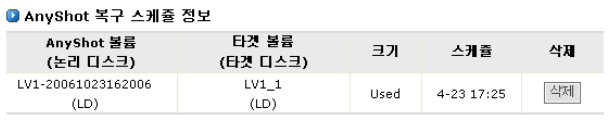  
[ 그림 5.4.22 AnyShot 볼륨 복구 예약 리스트]

#### ▶ AnyShot 볼륨 복구 예약 삭제

> AnyShot 볼륨 복구 생성 예약을 삭제하기 위해서는 AnyShot 볼륨 복구 예약 리스트의 해당 항목에 버
튼을 클릭하십시오(그림 5.4.22 참조)

