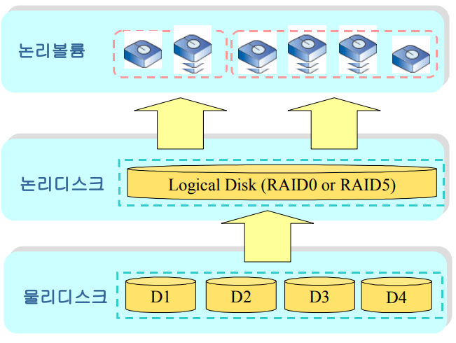

# 3 볼륨 관리(LVM)

## 3.1  볼륨 관리(LVM) 개요

AnyManager의 논리 볼륨 관리자(LVM: 논리 볼륨 Manager)는 실제 디스크를 논리적인 볼륨으로 바
꾸어 주는 기능을 가지고 있습니다.

 물리적으로 떨어져 있는 여러 개의 디스크를 하나의 커다란 볼륨으
로 구성하거나, 여러 개의 작은 볼륨으로 구성하는 등의 다양한 볼륨 관리가 가능하며, 실제 디스크들이
할 수 없는 온라인 볼륨 확장이나 스냅샷 같은 복잡한 기능들을 제공합니다.
  
AnyManager의 볼륨 관리는 논리 디스크의 설정 및 논리 볼륨 설정의 두 단계를 거쳐 수행됩니다.

AnyManager의 볼륨 관리는 [그림 3.2.1]에 표현되어 있습니다. 하나 이상의 물리 디스크는 하나의 RAID
0 혹은 RAID5 타입의 논리 디스크로 구성될 수 있으며, 논리 디스크는 하나 이상의 논리 볼륨으로 생성
됩니다.

 
  
[ 그림 3.2.1   AnyManager의 스토리지 관리 ]