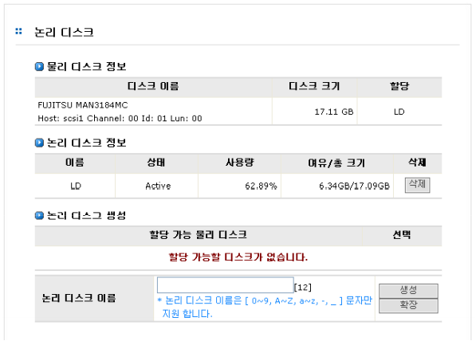
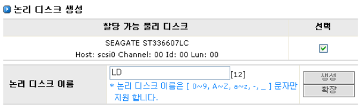
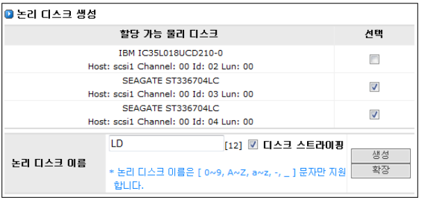
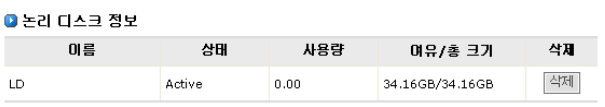
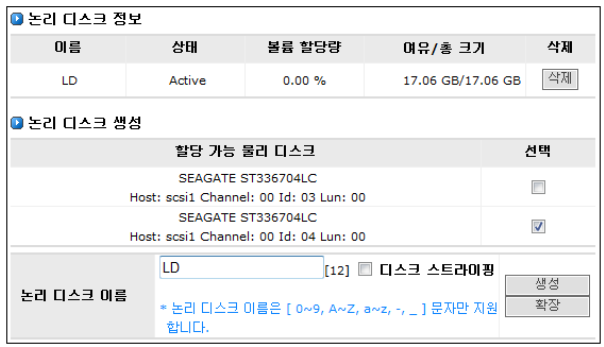

## 3.2 논리 디스크 설정
 
[LVM]-[논리 디스크] 메뉴는 실제 디스크들을 가상의 논리 디스크로 변환 시켜주는 역할을 수행합니
다. 하나 이상의 물리 디스크를 논리 디스크로 만들 수 있습니다.  
[그림 3.2.2]는 논리디스크의 설정을 위한 GUI를 나타내고 있습니다.

  
[ 그림 3.2.2    논리 디스크의 설정 관리 ]

#### ▶ 물리디스크

> 실제적인 디스크 장비입니다. AnyStor는 물리 디스크를 자동으로 발견하여 그 정보를 GUI를 통하여 보여 줍니다.

>  [그림 3.2.2]에서 나타내는 바와 같이 GUI를 통하여 보여주는 정보는 디스크 이름, 타입과 디
 스크의 크기 및 논리 디스크 할당 정보 입니다.
 
#### ▶ 논리디스크
 
> 관리자는 한 개 또는 그 이상의 실제 디스크들로부터 논리 디스크를 만들 수 있습니다. 논리 디스크는
물리 디스크가 여러 개 일지라도 하나의 디스크로 동작할 수 있게 해줍니다.

> AnyManager는 생성된 논리 디스크의 정보를 GUI를 통하여 제공합니다. [그림 3.2.2]에서 나타내는 바와
같이 논리 디스크 이름, 상태, 사용량 등의 정보가 제공됩니다.

#### ▶ 논리디스크 생성

* 디스크 스트라이핑을 사용하지 않는 논리 디스크 생성

	① [LVM]-[논리 디스크] 메뉴로 이동합니다

	② 할당 가능 물리 디스크를 선택합니다.

	③ [그림 3.2.3]과 같이 **“논리 디스크 이름”**을 입력합니다.

	④ **“논리 디스크 생성’** 항목에서 **생성** 버튼을 클릭합니다.

 
  
[ 그림 3.2.3   논리 디스크의 생성 ]
  

* 디스크 스트라이핑을 사용하는 논리 디스크 생성 ( ***옵션 사항 : 기술지원에 문의*** )

	① [LVM]-[논리 디스크] 메뉴로 이동합니다 .
	
	② 최소 2개 이상의 같은 크기( 오차 범위: 0.1GB )의 할당 가능 물리 디스크들을 선택합니다.
	
	③ [그림 3.2.4]와 같이 **“논리 디스크 이름”**을 입력합니다.
	
	④ 디스크 스트라이핑 체크 박스를 체크합니다.
	
	⑤ **“논리 디스크 생성’** 항목에서 **생성** 버튼을 클릭합니다.
	
  
[ 그림 3.2.4   논리 디스크의 생성 ]

* 생성된 논리디스크의 정보는 ‘논리디스크’ 항목에서 확인할 수 있습니다. [그림3.1.5]은 앞의 논리 디
스크 생성 명령에 의해 생성된 논리 디스크의 정보를 표시합니다.

  
[ 그림 3.2.5 논리 디스크 정보 표시 ]

+	** ※ NOTE **
	
	논리디스크를 RAID5로 잡을 경우 디스크 빌드 타임으로 인한 2~3시간의 시간 소요가 필요합니다.
	
	논리디스크 생성 시 주의 바랍니다. ( AnyStor 500 모델 )
	
	
#### ▶ 논리디스크 확장

① 할당 가능한 물리 디스크를 선택합니다.
	
② 논리 디스크 정보를 참조하여 이미 생성되어 있는 확장하고자 하는 **“논리 디스크의 이름”** 을 입력합니다.
	
③ **“논리 디스크 생성’** 항목에서 **생성** 버튼을 클릭합니다.

  	
[ 그림 3.2.6 논리 디스크의 확장 ]	

#### ▶ 논리디스크 삭제

① [그림 3.2.5]의 **“논리 디스크 정보”** 항목에서 삭제할 수 있습니다. 논리 디스크 삭제는 **“논리 디스크 정보”**항목에서 삭제하려고 하는 논리 디스크에 해당하는 **삭제**버튼을 눌러
삭제할 수 있습니다.

② 해당 논리 디스크에 볼륨이 생성되어 있지 않으면 바로 삭제가 가능합니다.

③ 해당 논리 디스크에 논리 볼륨이 포함되어 있는 경우 삭제가 되지 않으며, 삭제를 하기
위해서는 논리 디스크 내에 포함되어 있는 논리 볼륨들을 모두 제거해야 합니다. 논리 볼
륨의 제거는 다음 항의 [[논리 볼륨] ](#52-논리-볼륨-설정)메뉴에서 설명합니다.

+	** ※ NOTE **

	많은 I/O 가 일어날 경우에 논리 디스크 메뉴의 항목들을 디스플레이 하는데 시간이 걸릴 수 있습니다.
	
	화면이 나타날 때까지 기다려 주십시오.

    