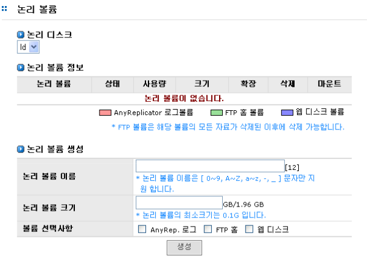
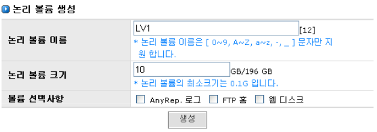
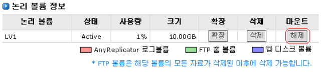
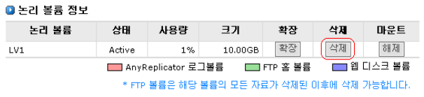
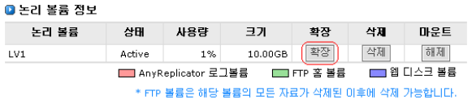
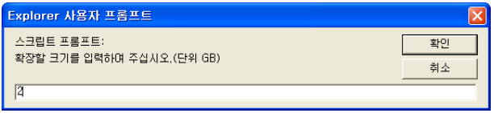

## 3.3 논리 볼륨 설정

[논리 볼륨] 메뉴는 논리 디스크를 기반으로 가상의 논리 볼륨을 생성하는 역할을 수행합니다. 하나의
논리 디스크에는 하나 이상의 논리 볼륨을 생성할 수 있습니다.

[그림 3.3.1]는 논리 볼륨의 설정을 위한 GUI를 나타내고 있습니다. 
    
  
[ 그림 3.3.1  논리 볼륨 설정 관리 화면 ]	

#### ▶ 논리 볼륨
> 논리 볼륨은 일반 디스크의 파티션처럼 논리 디스크를 여러 개의 논리 볼륨으로 나눌 수 있습니다. 또한
볼륨의 크기도 확장될 수 있으며 파일 시스템은 이 영역에서 만들어 집니다.

####▶ 논리 볼륨 생성

① 논리 볼륨은 [LVM]-[논리 볼륨] 메뉴에서 관리가 가능합니다.

② 논리 볼륨을 생성하기 위해서는 논리 볼륨이 포함되어야 할 논리 디스크를 먼저 선택해
야 합니다. [그림 3.3.1]는 논리 볼륨을 생성하기 위해 “LD”라는 논리 디스크를 선택한 그
림을 보여주고 있습니다.

③ 논리 디스크를 선택하면 논리 디스크 내에 선택되어 있는 논리 볼륨의 정보를 볼 수 있
습니다.

④ 논리 볼륨은 “논리 볼륨 생성” 항목에서 생성합니다. [그림 3.3.2]은 볼륨의 이름이 “LV1”
이고 크기가 10GB 인 볼륨을 생성하는 예입니다.  

  	
[ 그림 3.3.2 논리 볼륨 생성 ]  

⑤ 원하는 볼륨의 이름을 입력하십시오.

⑥ 원하는 볼륨 크기를 입력하십시오. 이때 우측의 최대 볼륨 크기를 확인해야 합니다. [그림 3.3.2]의 경우 최대 볼륨 크기는 196GB입니다. 최대 볼륨 크기 이내의 볼륨 크기를 입
력하십시오. (최소 볼륨 크기는 0.1GB입니다.)

⑦ FTP 홈 기능을 사용하시려면 **“FTP 홈”**항목을 체크하여 주십시오.(***주의:FTP는 옵션 사항입니다. 기술지원에 문의하십시오.***)

⑧ **생성** 버튼을 누르십시오.

⑨ 논리 볼륨 이름과 논리 볼륨 크기를 정상적으로 입력하였을 경우 논리 볼륨이 생성됩니
다. 정상적인 입력 값이 입력되지 않았을 경우 에러 메시지가 발생합니다. 에러 메시지가
발생한 경우 메시지 확인 후 적절한 값을 입력하십시오.

⑩ 논리 볼륨의 생성 여부는 **“논리 볼륨 정보”**에서 확인할 수 있습니다. 생성된 볼륨은 자동
으로 마운트 되어 즉각 사용이 가능합니다. 시스템의 비 정상적인 동작으로 인하여 생성
된 볼륨이 마운트 되지 않았을 경우 **“논리 볼륨 정보’** 항목의 **“마운트”** 필드에서 마운트
와 언마운트가 가능합니다.  

  
[ 그림 3.3.3 논리 볼륨 정보 ]

+	** ※ NOTE **
	I/O가 일어날 경우에 논리 디스크 메뉴의 항목들을 디스플레이 하는데 시간이 걸릴 수 있습니다. 
	화면이 나타날 때까지 기다려 주십시오.

#### ▶ 논리 볼륨 삭제

① 논리 볼륨의 삭제는 “논리 볼륨 정보”에서 수행합니다. “논리 볼륨 정보” 항목의 “삭제”
필드에서 삭제가 가능합니다.

② **삭제** 버튼을 누르십시오(그림 3.3.4 참조)

③ 메시지 창이 나오면 **“확인”** 버튼을 선택하십시오.

④ 해당 볼륨이 공유되어 잇는 경우는 볼륨을 삭제할 수 없습니다. 이 경우 [[공유]](#8-공유-관리) 메뉴로
가서 해당 볼륨의 공유를 제거하고 난 후 삭제가 가능합니다.

  
[ 그림 3.3.4 논리 볼륨 삭제 ]

+ ** ※ NOTE **
	많은 I/O 가 일어날 경우에 논리 볼륨의 삭제에 시간이 걸릴 수 있습니다. 또한 AnyShot 볼륨을 가지고 있
	다면 제거할 수 없습니다. 만일 관리자가 제거 하길 원한다면 모든 스냅샷 볼륨을 제거 해야 합니다.
	
	
#### ▶ 논리 볼륨 확장

① 논리 볼륨의 확장은 “논리 볼륨 정보”에서 수행합니다. “논리 볼륨 정보” 항목의 “확장”
필드에서 확장이 가능합니다.

② **확장**버튼을 누르십시오(그림 3.3.5 참조)

  
[ 그림 3.3.5 논리 볼륨 확장 ]

③ **“ 확장”** 버튼을 누르면 [그림 3.3.6]의 입력 창을 볼 수 있습니다.

  
[ 그림 3.3.6 논리 볼륨 확장을 위한 입력창 ]      

④ 확장을 원하는 만큼 크기를 입력하세요. [그림 3.3.6]은 2GB를 확장한 예입니다.

⑤ 확장을 원하시면 **“확인”** 버튼을 누르세요. 취소를 원하시면 **“취소”** 버튼을 누릅니다.

⑥ 논리 디스크 내에 확장을 원하는 만큼의 여분의 공간이 존재할 경우 볼륨은 온라인으로
확장됩니다. 확장이 완료되면 논리 볼륨의 크기가 확장되어 “논리 볼륨 정보” 항목에 표
시됩니다.

⑦ 논리 디스크 내에 확장을 원하는 만큼의 여분의 공간이 존재하지 않을 경우 에러 메시지
가 발생합니다.

+ ** ※ NOTE **
	많은 I/O가 일어날 경우에 논리 볼륨 확장에 시간이 다소 걸릴 수 있습니다.

