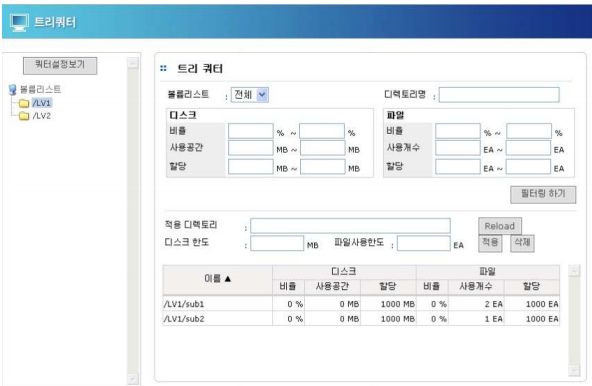
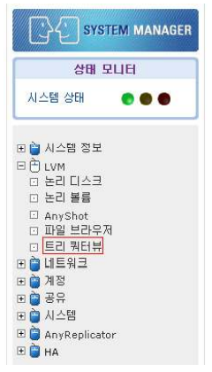
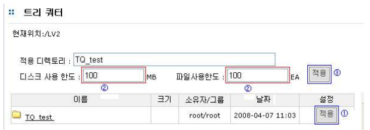
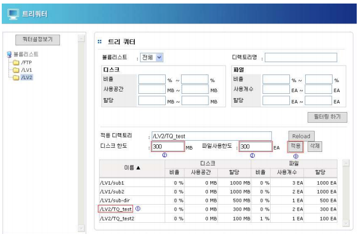
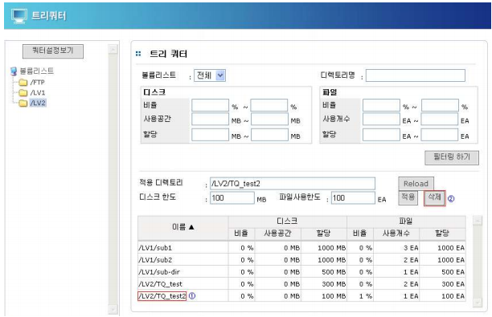
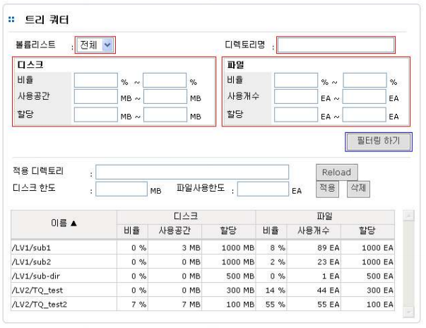
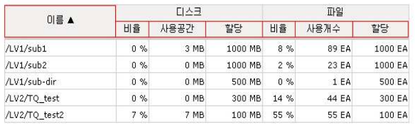

## 3.4 Tree Quota 서비스

Tree Quota는 디렉토리 단위로 디스크 사용량을 할당 및 제어할 수 있는 기능으로, 한정적인 시스템
자원을 효율적으로 사용할 수 있는 방법을 제공합니다.

 

  
[ 그림 3.4.1 Tree Quota 설정 ]

#### 1. Tree Quota 서비스 구동

*  Tree Quota 패치를 진행하고도 [LVM] – [트리쿼터뷰] 메뉴가 보이지 않는다면, Tree Quota
서비스를 사용할 수 없는 상태입니다. 몇 가지 설정이 더 필요한 상황이며, 이는 당사 기술
지원팀에 문의해 주시기 바랍니다.

  
[ 그림 3.4.2 Tree Quota 설치 확인 ]

### 3.4.1 Tree Quota 설정

AnyStor Manager의 [LVM] – [트리쿼터 뷰]를 통해 쿼터 설정 및 수정, 삭제를 할 수 있습니다.

#### 1. Tree Quota 생성

  
[ 그림 3.4.3 Tree Quota 생성 ]

>	① **[적용]**을 눌러서 트리쿼터를 설정하고자 하는 디렉토리를 선택합니다.

>	② 용량/파일 사용 한도를 설정합니다.

>	③ **[적용]**을 눌러서 트리쿼터 변경을 완료합니다.

#### 2. Tree Quota 수정

  
[ 그림 3.4.4 Tree Quota 수정 ]

>	① 수정하고자 하는 디렉토리 경로를 선택합니다.

>	② 용량 및 파일 사용 한도를 설정합니다.

>	③ **[적용]**을 눌러서 설정을 갱신합니다.

#### 3. Tree Quota 삭제

  
[ 그림 3.4.5 Tree Quota 삭제 ]

>	① 삭제하고자 하는 디렉토리를 선택합니다.

>	② **[삭제]** 버튼을 눌러 삭제시킵니다.

### 3.4.3 Tree Quota 운용

#### 1. Tree Quota 필터링

  
[ 그림 3.4.6 Tree Quota 필터링 ]

>	• 디스크/파일에 따른 필터링으로 트리쿼터 결과를 모니터링 할 수 있습니다.

>	• 디스크 : 디스크 사용 비율, 사용 공간, 할당 용량

>	• 파일 : 파일 비율, 사용 개수, 할당 개수

#### 2. Tree Quota 정렬

  
[ 그림 3.4.7 Tree Quota 정렬 ]

>	• 필터링한 결과값을 사용자 지정에 맞게 재정렬 해줍니다.

>	• 디렉토리 이름/디스크 비율, 사용공간, 할당/파일 사용 비율, 사용 개수, 할당 등 각 항목을
클릭하면 내림차순, 오름차순으로 정렬 순서가 바뀝니다.

  