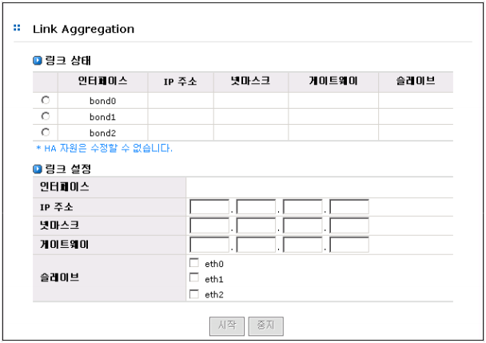
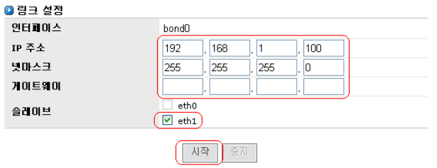

# 4.4 Link Aggregation

AnyStor NAS는 시스템의 failover와 load balancing을 지원합니다. 2개 이상의 네트워크 어댑터를 하 나의 팀으로 구성하며, 구성된 팀은 데이터의 수신과 전송을 동시에 수행합니다. 이 경우 하나의 네트워 크 어댑터나 케이블의 문제가 발생시 다른 살아있는 링크를 이용하여 통신이 가능하므로 지속적인 서비 스를 제공할 수 있습니다.

  
 Link Aggregation이 제공하는 기능은 다음과 같습니다. \( 초기 시스템 설정 시 변경이 가능한 부분입니 다. 사용자 변경 불가능 하며, 변경 시 기술지원에 문의하시기 바랍니다. \)

> **A. Failover Teaming**
>
> 어댑터에 문제가 발생하거나 케이블이 손상되었을 때 내결합성을 제공합니다. 어댑터들은 팀 으로 구성되며 primary 어댑터에 문제가 발생하여 다운되었을 때 secondary 어댑터가 활성화 됩니다. 이로 인해 어댑터가 문제를 발생시켜도 사용자는 아무런 어려움 없이 세션을 유지시 킬 수가 있습니다.
>
> **B. Load Balance**
>
> 팀을 구성하고 있는 어댑터 중 어느 한쪽에 로드가 집중될 때 로드가 다시 측정되어 살아있는 다른 어댑터에 부하를 분산시킵니다. 이로 인해 부하가 균형을 이루게 되며 성능을 향상시킬 수가 있습니다.
>
> **▶ Link Aggregation 설정**
>
> Link Aggregation 설정항목에서는 가상어댑터의 IP Address, Netmask, Gateway등을 설정할 수 있으며 가용어댑터의 팀 구성을 선택할 수 있습니다.

\[그림 4.4.1\]은 Link Aggregation의 설정관리를 위한 웹 GUI입니다

   
 \[ 그림 4.4.1 Link Aggregation의 설정 \]

  
 ① 링크 상태에서 우선 팀을 대표하는 인터페이스를 선택합니다.

   
 \[ 그림 4.4.2 인터페이스 선택 \]

  
 ② 그 후 링크 설정 부분의 IP주소, 넷마스크, 게이트웨이 값을 설정해 준 뒤 팀에 참여하는 멤버 네트워크 어댑터\(슬레이브\)들을 선택합니다.

   
 \[ 그림 4.4.3 설정 정보 설정 \]

  
 ③ **시작** 버튼 을 클릭하여 Link Aggregation 기능을 동작시킵니다.

   
 \[ 그림 4.4.4 Aggregation 설정 완료 \]

  
 ④ Link Aggregation 해제를 원할 경우, 먼저 링크 상태에서 정지하고자 하는 인터페이스를 선택한 뒤 **중지** 버튼을 클릭합니다. 가상어댑터는 사라지고, 이전 IP Address로 돌아 가게 됩니다.

