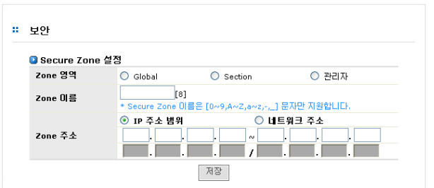
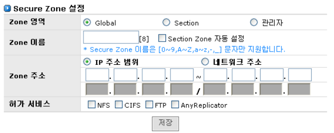
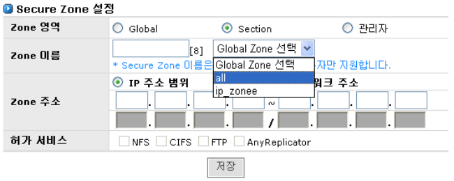
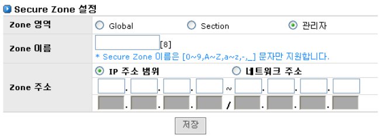
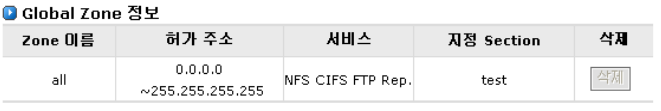
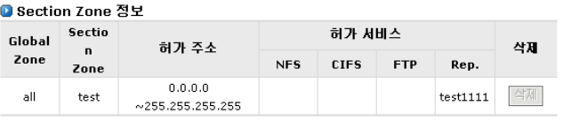
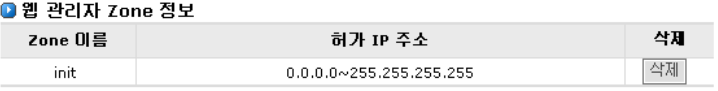

# 4.2 보안

네트워크를 통하여 AnyStor NAS 에 접근 가능 하기 위해서는 Secure Zone 을 설정해야만 합니다. A nyStor는 기본설정으로 모든 IP 거부\(All Deny\)를 채택합니다. 다시 말하면, 공유에 접근하기 위해선 접 근하고자 하는 신뢰할 수 있는 호스트 또는 네트워크을 Secure Zone에 등록해 주어야만 합니다.

  
 Secure Zone 은 적용영역에 따라 3가지로 구성된 Zone 영역으로 구분할 수 있습니다.

   
 \[ 그림 4.2.1 보안 항목 \]

## ▶ Zone 영역

> A. Global Zone : NFS나 CIFS 프로토콜에 접근할 수 있는 호스트 또는 네트워크를 등록할 수 있습니다. 일반적으로 사내에 할당된 네트워크 어드레스 또는 특정 시스템 구성에 참 여하는 클라이언트 네트워크 어드레스로 구성할 수 있습니다.
>
> B. Section Zone : NFS나 CIFS프로토콜에 해당하는 공유에 접근할 수 있는 호스트 또는 네 트워크를 등록할 수 있습니다. Section Zone은 특정 Global Zone에 소속되며, Global Zo ne의 설정영역\(Zone 주소, Allow 서비스\)을 넘어설 수 없습니다.
>
> C. 관리자 Zone : 웹 매니저에 접근할 수 있는 호스트 또는 네트워크를 등록할 수 있습니다.

## ▶ Global Zone 설정

   
 \[ 그림 4.2.2 Global Zone 설정 \]

> A. Zone 영역 항목에서 Global 라디오 버튼을 클릭합니다.
>
> B. Zone 이름
>
> > ① 이름을 입력합니다. 이름은 관리의 편의를 위한 것으로, 가능하면 구분이 용이 하도록 입력합니다. 한글 및 특수문자는 입력할 수 없고, 동일 zone name도 허 용하지 않습니다.
> >
> > ② 해당 Global Zone과 동일한 권한을 갖는 Section Zone을 생성하고 싶은 경우, Allow Section Zone Setting체크박스에 클릭합니다. 그러면 마지막에 \(+\)가 추 가된 Section Zone이 동시에 생성됩니다.
>
> C. Zone Address
>
> > ① IP 주소 범위 : 허용하고자 하는 IP 주소 범위를 기입합니다. 현재 C 클래스 이 내의 범위만 기입 가능합니다.
> >
> > ② 네트워크 주소 : 허용하고자 하는 네트워크 주소를 기입합니다.
> >
> > > a. IP : 네트워크 어드레스에 일치하지 않는 주소는 적합한 주소로 변경 되어 저장됩니다.
> > >
> > > b. Netmask : Netmask 규칙에 허용되지 않는 경우 저장되지 않습니다.
>
> D. 허가 서비스 : 허용할 서비스를 선택합니다.

## ▶ Section Zone 설정

   
 \[ 그림 4.2.3 Section Zone 설정 \]

> A. Zone 영역 항목에서 Section 라디오 버튼을 클릭합니다.
>
> B. Zone 이름
>
> > ① 이름을 입력합니다. 이름은 관리의 편의를 위한 것으로, 가능하면 구분이 용이 하도록 입력합니다. 한글 및 특수문자는 입력할 수 없고, 동일 zone name도 허 용하지 않습니다.
> >
> > ② 소속될 Global Zone을 선택합니다.
>
> C. Zone 주소
>
> > ① By IP Address Range : Address의 범위는 해당 Global Zone의 Address 범위를 벗어나지 않도록 설정합니다.
> >
> > ② By Network Address : Address의 범위는 해당 Global Zone의 Address 범위를 벗어나지 않도록 설정합니다.
>
> D. 허가 서비스 : 허용할 서비스를 선택합니다.

## ▶ Manager Zone

   
 \[ 그림 4.2.4 Manager Zone 설정 \]

> A. Zone 영역 항목에서 Manager 라디오 버튼을 클릭합니다.
>
> B. Zone 이름 : 이름을 입력합니다. 이름은 관리의 편의를 위한 것으로, 가능하면 구분이 용 이하도록 입력합니다. 한글 및 특수문자는 입력할 수 없고, 동일 zone name도 허용하지 않습니다.
>
> C. Zone 주소 : 관리자의 IP Address Zone을 입력합니다.

## ▶ Global Zone 정보

   
 \[ 그림 4.2.5 Global Zone 설정 \]

> A. Zone 이름 : Zone name을 보여줍니다.
>
> B. 허가 주소 : 허용된 IP Address 범위를 보여줍니다.
>
> C. 서비스 : 허용된 서비스들을 보여줍니다.
>
> D. 지정 Section : 소속된 Section Zone 들을 보여줍니다.
>
> E. 삭제 : 소속된 Section이 없는 경우 ‘삭제’버튼이 활성화 됩니다.

## ▶ Section Zone 정보

   
 \[ 그림 4.2.6 Section Zone 설정 \]

> A. Global Zone : 소속된 Global Zone name을 보여줍니다.
>
> B. Zone 이름 : Zone 이름을 보여줍니다.
>
> C. 허가 주소 : 허용된 IP Address 범위를 보여줍니다.
>
> D. NFS : 해당 Section이 NFS 프로토콜에 사용된 공유 이름을 보여줍니다.
>
> E. CIFS : 해당 Section이 CIFS 프로토콜에 사용된 공유 이름을 보여줍니다.
>
> F. 삭제 : 사용된 공유가 없는 경우 ‘삭제’버튼이 활성화 됩니다.

## ▶ 웹관리자 Zone 정보

   
 \[ 그림 4.2.7 웹관리자 Zone 설정 \]

> A. Zone 이름 : Zone 이름을 보여줍니다.
>
> B. 허가 주소 : 허용된 IP Address 범위를 보여줍니다.
>
> C. 삭제 : 삭제하고 싶은 경우 ‘삭제’버튼을 클릭합니다.

