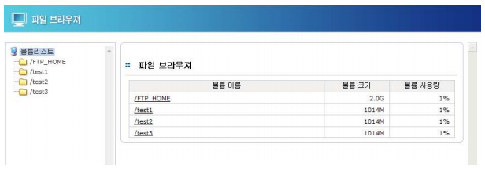
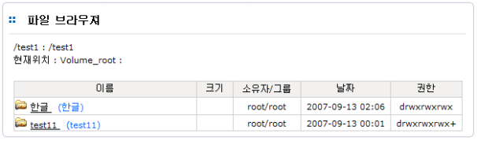

## 5.5 파일 브라우져

파일 브라우져는 AnyStor NAS 에서 생성한 볼륨에 대해 사용자가 업로드한 파일에 대한 브라우징을
제공합니다. 기본적으로 생성한 볼륨의 정보와 각 볼륨 내 존재하는 디렉터리, 파일에 대한 정보( 파일
명, 크기, 소유주, 업데이트 시간, 권한 등 ), 볼륨 내 경로가 가진 공유 등을 표시합니다.

 
  
[ 그림 5.5.1 파일 브라우져 초기 화면 ]

 
  
[ 그림 5.5.2 파일 브라우져 볼륨 내 파일/디렉터리 정보 ] 

