# 6.9 ACL 관리자

ACL은 파일 및 폴더에 접근이 허가된 사용자 또는 그룹과 이들이 허가 받은 접근 종류들을 기록한 목 록입니다. ACL 관리자는 각 공유별로 ACL을 적용하여 서비스 사용자를 관리할 수 있도록 지원합니다. \( 단, 접근모드가 ACL 이 아니면 ACL 정보 변경 시, 공유의 문제가 발생할 수 있습니다. \) 또한 각 공유의 공유구조를 한 눈에 파악할 수 있도록 공유리스트 트리\(tree\) 를 제공합니다.

* ※ ACL 관리자는 Anystor 5 이전 버전에서는 공유 접근모드가 ACL 인 경우에 사용가능합니다

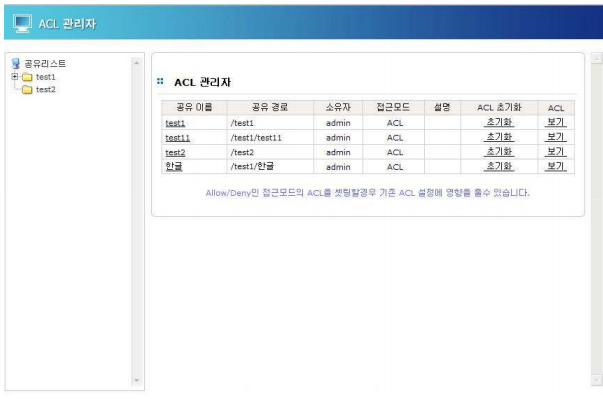  
 \[ 그림 6.9 ACL 관리자 초기 화면 \]

## 6.9.1 주요 기능

### ▶ 공유 구조 트리

Anystor NAS 의 공유는 이미 생성된 공유의 하위 디렉토리에 대 해 또 다른 공유가 가능한 계층구조를 가집니다. 생성된 공유들 사이에서 이러한 계층을 확인하기 위해 공유 경로를 일일이 비교 하는 것은 공유정보가 많을 경우, 어려워 집니다. 그러나 ACL 관 리자의 공유트리는 공유정보들 사이의 계층구조를 트리형식으로 표시함으로써 관리자가 공유구조를 파악하는데 편의를 제공합니 다.

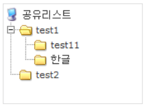 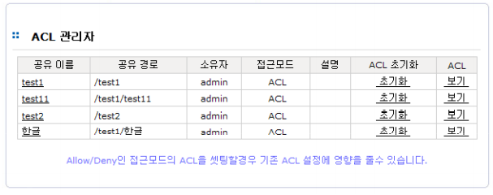  
 \[ 그림 6.9.1 ACL 관리자 – 공유 정보 \]

### ▶ 공유 및 디렉토리, 파일 사용자/그룹 접근 제어

> A. ACL 관리자의 목록에서 선택한 공유 및 디렉토리, 파일에 대해 사용자 또는 그룹을 접 근허가하고 허가할 권한을 설정할 수 있습니다. 허가권한은 읽기, 읽기/쓰기, 권한없음 을 지원합니다. 이미 상위의 디렉토리에서 설정한 접근권한이 있다면 상위 부모로부터 권한을 상속받거나 부모로부터 하위의 디렉토리 및 파일에 일괄적으로 적용시킬 수 있 습니다. 일괄적용시에는 하위 디렉토리에 특별히 추가된 권한에 대해서 삭제할 것인지 \( 하위폴더에 덮어쓰기 \), 상위의 설정을 단순 전파만 할 것인지\( 하위폴더에 전파 \) 선 택할 수 있습니다.
>
> B. \[ 그림 6.9.2 \] 는 \[ 그림 6.9.1 \] 의 공유test1에 설정된 접근정보를 열람한 모습입니다 . 새로운 사용자 또는 그룹을 추가하거나 기존 사용자 또는 그룹을 수정/삭제 할 수 있 으며 상속과 관련한 명령을 수행할 수 있습니다.

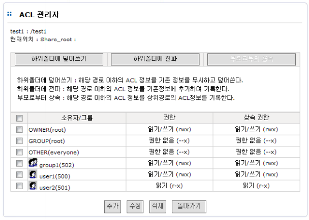  
 \[ 그림 6.9.2 ACL 관리자 – 공유 접근 제어 \]

* **※ NOTE**

  OWNER : 파일 또는 디렉터리의 소유자

  GROUP : 파일 또는 디렉터리의 소유그룹

  OTHER : 파일 또는 디렉터리를 소유자나 소유그룹이 아닌 다른 사용자 또는 그룹

## 6.9.2 공유 ACL

### ▶ 공유 정보 보기

ACL관리자의 초기화면에서 각 공유의 이름과 공유경로, 공유소유자, 접근모드를 확인할 수 있습니다. 특히, 접근모드는 ACL을 사용하는데 매우 중요한 정보입니다. 접근모드가 Allow/Deny 모드이면 관리 자에 의해 수정된 ACL이 전체 공유에 영향을 줄 수 있으므로 신중히 설정해야 합니다.   
  
 공유의 최상위에서 설정된 ACL정보를 보려면 각 공유의 ACL 필드의 보기 버튼을 클릭합니다.

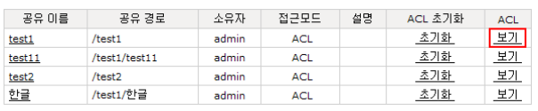  
 \[ 그림 6.9.3 ACL 관리자 – 공유 접근제어 정보보기 \]

### ▶ 접근모드와 ACL 초기화

> A. ACL 관리자에서 접근모드는 Allow/Deny 와 ACL 2가지 입니다. Allow/Deny 모드는 AC L 을 사용하지 않고 각 공유 프로토콜\(protocol\) 에서 사용자에 대한 허가여부만을 선 택할 수 있는 모드입니다. ACL은 허가여부뿐 아니라 사용자 혹은 그룹의 개별 접근권 한까지 선택 가능합니다.

* **※ NOTE**

  1\) Anystor 5 이전 버전에서는 Allow/Deny 모드 시 ACL관리자가 지원되지 않습니다.

  2\) 각 공유 별 접근모드 선택은 Anystor 5 이상 버전에서 지원됩니다.

> B. 접근모드의 변경\(Anystor 4.1.5 버전 이상\)은 AnyManager [**\[ 공유 \]-\[ 설정 \]**](acl.md#62-공유-설정) 에서 가능 합니다. 단, 상위의 공유가 존재하는 하위 공유는 상위의 공유 접근모드를 상속받아 사 용하므로 상위 공유의 접근모드를 수정해야 합니다.
>
> C. ACL 초기화는 선택한 공유에 적용된 사용자와 그룹을 모두 삭제하고 소유주와 소유그

* **※ NOTE**

  1\) Anystor 5 이전 버전에서는 Allow/Deny 모드 시 ACL관리자가 지원되지 않습니다.

  2\) 각 공유 별 접근모드 선택은 Anystor 5 이상 버전에서 지원됩니다.

> C. ACL 초기화는 선택한 공유에 적용된 사용자와 그룹을 모두 삭제하고 소유주와 소유그 룹, 모든 사용자에 대한 접근권한을 상속 없이 읽기,쓰기가 모두 가능한 상태로 초기화 합니다. 이 상태는 Allow/Deny 모드를 이용한 공유 시 유용한 환경이며, ACL 을 처음부 터 다시 적용할 경우에 사용 가능합니다. 단, 공유 이하의 파일 및 폴더가 많을 경우 초 기화가 완료될 때까지 오래 걸릴 수 있습니다. 초기화가 진행 중에는 다른 ACL 설정\( 상속 및 ACL 설정 \)을 하실 수 없습니다.

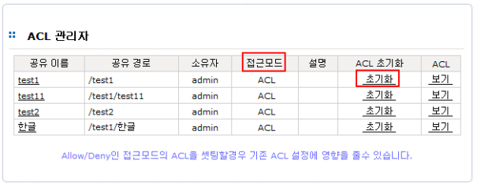  
 \[ 그림 6.9.4 ACL 관리자 – 접근모드와 ACL 초기화 \]

## 6.9.4 접근권한 설정

### ▶ 접근 권한 생성

> A. ACL을 적용할 공유의 최상위 혹은 공유 내 디렉토리로 이동하여 **ACL** 필드의 **보기** 를 선택합니다. \[ 그림 6.9.5 \]는 공유test11의 ACL 정보이면서 공유test1의 하위 test11 디렉토리의 정보입니다. \( 공유test11 은 공유test1 의 하위에 생성된 하위 공유입니다. \) 화면 하단의 **추가** 버튼을 클릭합니다.
>
> B. \[ 그림 6.9.6 \]은 사용자 및 그룹을 추가하는 모습입니다. user1 과 user2, group1 과 g roup2 를 읽기 권한으로 설정합니다. 상속설정은 해당 디렉토리에서만 적용할 것인지 설정 이후, 하위에 생성되는 디렉토리에도 현재설정을 상속\(유지\)시킬 것인지를 설정합 니다. \( 상속하지 않을 경우, 서비스 운영중 사용자가 업로드한 파일 및 디렉토리는 타 사용자가 접근할 수 없습니다. \) 권한은 읽기 와 읽기/쓰기 를 설정할 수 있고 상속설정 은 상속과 상속안함 을 설정할 수 있습니다.
>
> C. 사용자 및 그룹이 추가되었으면 **적용** 버튼을 클릭합니다.
>
> D. \[ 그림 6.9.7 \]은 사용자/그룹 추가가 적용된 모습입니다.

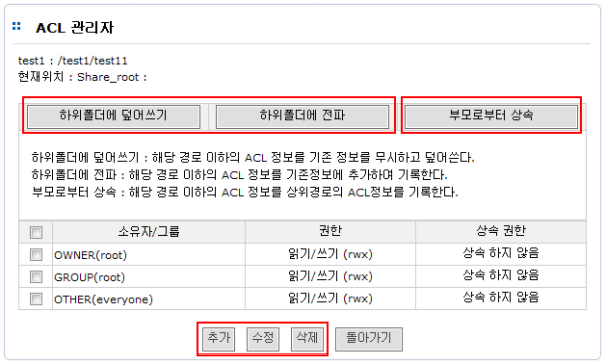  
 \[ 그림 6.9.5 ACL 관리자 – ACL 설정 \]

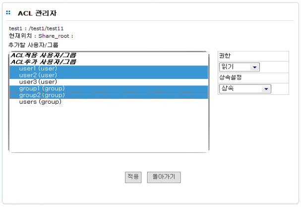  
 \[ 그림 6.9.6 ACL 관리자 – ACL 사용자/그룹 추가 \]

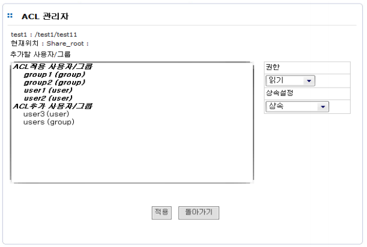  
 \[ 그림 6.9.7 ACL 관리자 – ACL 사용자/그룹 추가 적용 \]

### ▶ 접근 권한 수정

> A. \[ 그림 6.9.8 \]은 추가된 사용자와 그룹의 권한을 수정하기 위한 화면입니다. 사용자 권한이 추가되면 OWNER와 GROUP, OTHER 는 자동으로 상속됩니다. 수정할 사용자 또는 그룹의 체크박스를 선택하고 **수정** 버튼을 클릭합니다.

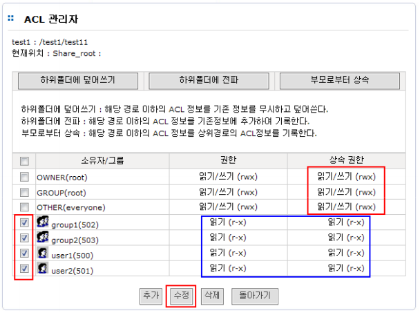  
 \[ 그림 6.9.8 ACL 관리자 – ACL 사용자/그룹 수정\]

> B. \[ 그림 6.9.9 \]는 권한 과 상속설정을 수정하는 화면입니다. 선택한 사용자와 그룹은 화면 좌측에 목록을 표시해 줍니다. 이 과정에서는 읽기 권한으로 설정되었던 사용자 와 그룹을 읽기/쓰기 권한으로 변경하였습니다. 권한으로 설정 가능한 옵션은 이전권 한유지와 읽기, 읽기/쓰기, 권한없음 입니다. 상속설정은 이전 상속을 그대로 사용하도 록 이전상속유지 로 설정합니다. 설정가능한 옵션은 이전상속유지와 상속, 상속안함 입 니다.
>
> C. 설정이 완료되면 **적용**버튼을 클릭합니다

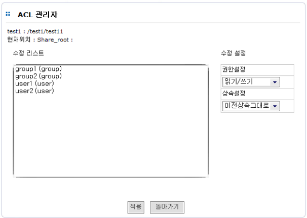  
 \[ 그림 6.9.9 ACL 관리자 – ACL 사용자/그룹 수정 설정 \]

### ▶ 접근 권한 삭제

> A. \[ 그림 6.9.10 \]은 추가/수정 된 그룹 group1 과 group2 를 삭제하는 과정입니다. 삭제 할 사용자 또는 그룹을 체크박스에서 선택하고 삭제버튼을 클릭합니다.
>
> B. ACL 정보 삭제를 확인하는 창에서 확인을 선택하시면 선택된 사용자 또는 그룹이 삭제 됩니다.

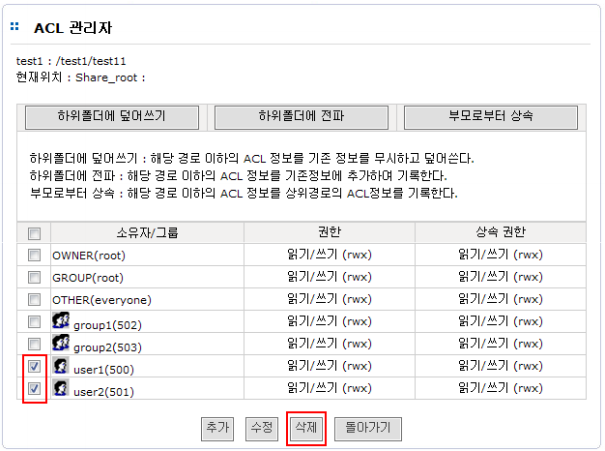  
 \[ 그림 6.9.10 ACL 관리자 – ACL 사용자/그룹 삭제 \]

### ▶ 접근 권한 상속

> 사용자 또는 그룹의 접근 권한이 모두 설정된 이후에 하위 경로에 존재하는 모든 파일과 디렉토리에 설정된 정보를 전파할 수 있습니다. 이 과정을 통해 작업을 일괄 처리함으로써 또 다른 공유 혹은 디 렉토리에 대해 중복된 작업을 피할 수 있습니다. 단, 상속권한이 설정되지 않은 사용자 또는 그룹은 상 속되지 않습니다.   
>   
>
>
> **하위폴더에 덮어쓰기** 는 선택된 공유 혹은 디렉토리에서 하위에 존재하는 디렉토리에 대해 현재 설정정보를 그대로 하위로 복제합니다. 하위에 또 다른 접근제어 설정이 존재하더라도 기존의 설정을 무시합니다. 따라서 이 동작 이후에 하위 디렉토리는 모두 같은 설정 정보로 설정됩니다. \( 단, 상위에 서 상속 권한이 없는 사용자/그룹 정보는 설정되지 않습니다. \)   
>   
>
>
> **하위폴더에 전파**는 **하위폴더에 덮어쓰기**와 기능적으로는 같은 동작을 합니다. 하지만 하위 디렉토리에서 별도로 추가된 사용자/그룹 접근제어 정보는 그대로 유지합니다. \( 단, 하위에 동일 한 사용자 또는 그룹에는 상위의 설정으로 적용됩니다. \)   
>   
>
>
> **부모로부터 상속**은 상위에 부모 디렉토리가 존재하는 경우에만 가능합니다. 상위의 부모 디 렉토리가 가진 상속가능하도록 설정한 상속권한을 받아 현재 디렉토리에 추가합니다.  
>   
>
>
> 공유 혹은 디렉토리의 상속과 달리 파일에 대한 접근제어정보에는 상속권한이 존재하지 않습니다.

