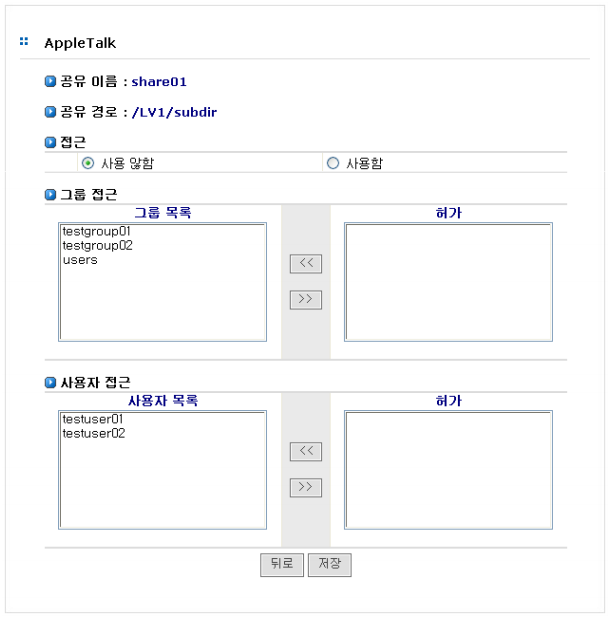

# 6.5 AppleTalk

AppleTalk은 매킨토시 시스템의 네트워크 Protocol로써 AnyStor NAS는 AppleTalk 프로토콜을 지원하 여 매킨토시 시스템의 Data를 저장할 수 있습니다. 웹 관리자는 AppleTalk 공유 설정에서는 공유 볼륨\( 디렉토리\) 설정에서 작성한 공유 리스트에 대한 접근 권한을 제어합니다.   
  
 \[그림 6.5\]은 ApplTalk 공유 설정을 위한 웹 화면이며, 데이터의 공유를 위해 공유 목록으로 설정된 볼 륨에 대한 접근 권한을 제어하는 예를 보여줍니다. 그룹과 사용자에 대한 접근권한을 설정할 수 있으며 CIFS 공유와 사용방법이 동일합니다.

  
 \[ 그림 6.5 Apple Talk 공유 설정 \]

