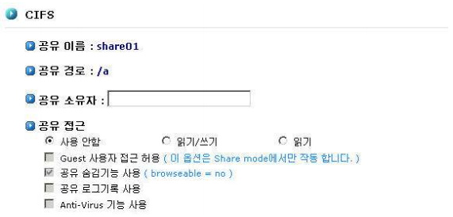
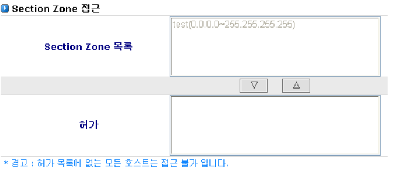
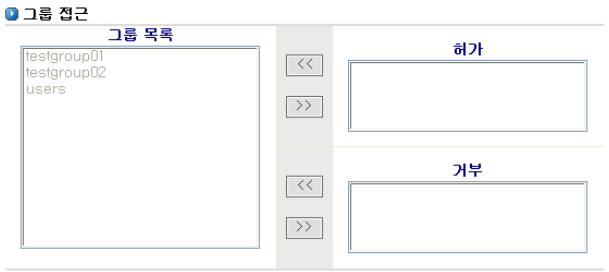

# 6.3 CIFS

CIFS는 Unix 계열 시스템과 Windows 계열 시스템간의 데이터 공유를 제공합니다. AnyStor NAS는 Win dows 플랫폼 시스템이 NAS 스토리지를 활용할 수 있도록 CIFS 프로토콜을 지원합니다. CIFS 공유 설정 에서는 공유 볼륨\(디렉터리\) 설정에서 작성한 공유 리스트에 대한 접근 권한을 제어합니다.   
  
 \[그림 6.3\]는 CIFS 공유 설정을 위한 웹 화면이며, 데이터의 공유를 위해 공유 목록으로 설정된 **“/LV1”** 볼륨에 대한 접근 권한을 제어하는 예를 보여줍니다.

  
 \[ 그림 6.3 CIFS 설정 관리 \]

* **※ NOTE**

  \[공유\]-\[설정\] 에서 공유목록 선택 후에 CIFS, NFS 및 AppleTalk의 접근 권한 제어를 할 수 있습니다. AnyStor 공유는 설정 저장 후 약 30초~1분 후에 설정이 적용됩니다. 바로 적용이 필요하실 때에는 \[공유\]-\[설정\]-**”공유 서비스 상태”**에서 재시작을 수행하여 주십시오. 단 재시작 수행 시 기존에 파일 IO 세션은 끊어지게 됨을 유의하시기 바랍니다.

## 6.3.1 CIFS서비스를 위한 접근 제어 항목

> A. 공유 소유자
>
> B. 공유 접근
>
> C. Section Zone 접근
>
> D. 그룹 접근
>
> E. 사용자 접근

## 6.3.2 공유 소유자

해당 공유에 대한 슈퍼 관리자를 설정할 수 있습니다. 공유 소유자는 공유 내의 모든 파일 및 속성에 대 한 제어 권한이 부여됩니다.

> A. 웹 관리자 ID인 ‘admin’은 암묵적으로 모든 공유의 공유 소유자가 됩니다. 하지만 웹에 서는 보이지 않습니다.
>
> B. 공유 소유자 추가 방법
>
> > a. \[계정\] 항목에서 사용자 추가 후 등록합니다.
> >
> > b. ADS, PDC 사용자 아이디도 입력 가능합니다.

## 6.3.3 공유 접근

> A. 사용 안함, 읽기/쓰기, 읽기 : 해당 공유에 대한 전반적인 접근 권한을 설정할 수 있습니다.
>
> B. Guest 사용자 접근 허용
>
> > a. [\[그림 6.3.1\]](cifs.md#63-공유-네트워크-구성)에서 설명한 [**‘공유 네트워크 구성’**](cifs.md#43-공유-네트워크-구성) 에서 인증 모드가 share 모드인경우 적용 가능합니다.
> >
> > b. 특별한 인증을 필요하지 않고서 해당 공유에 접근이 가능합니다.
>
> C. 공유 숨김 기능 사용 : 사용자에게 선택한 공유의 디렉터리가 보이지 않게 합니다.
>
> D. 공유 로그기록 사용 : 해당 공유에 대한 사용자 접근 및 작업내역을 기록합니다. 기록된 내용은 CIFS 공유기록 메뉴를 통해 확인 가능합니다. 로그기록에 따른 I/O 성능저하가 일 부 나타날 수 있으며 별도의 설치가 필요한 기능입니다.
>
> E. Anti-Virus 기능 사용 : 사용자가 해당 공유에 있는 파일을 엑세스 할때 자동으로 바이러 스 검사를 실시 합니다. 해당 기능은 anti-virus 기능을 추가로 설치 할 때 제공 됩니다

## 6.3.4 Section Zone 접근

  
 \[ 그림 6.3.1 Secure Zone 접근 설정 \]

> A. 해당 공유에 접근하고자 하는 Secure Zone을 등록합니다.
>
> B. 어떠한 Secure Zone도 등록되어 있지 않으면, 공유의 접근이 불가능합니다

## 6.3.5 그룹 접근

  
 \[ 그림 6.3.2 CIFS 그룹 접근 설정 \]

> A. 해당 공유에 대해 각 그룹별로 접근 제어를 하는 항목입니다. 그룹 접근 제어를 위해서는 해당 그룹이 등록되어 있어야 합니다.
>
> B. 그룹에 대한 등록은 \[계정\]-\[그룹\]에서 수행할 수 있습니다.
>
> C. 접근 제어를 위한 그룹이 등록되어 있는 경우 \[그림 6.3.2\]의 그룹 접근 제어 GUI를 이용 하여 접근 제어의 수행이 가능합니다.
>
> D. **‘그룹 목록’**에서 접근 제어를 설정할 대상 그룹을 선택합니다.
>
> E. 선택된 그룹을 허가 또는 거부 항목으로 이동시킵니다.
>
> F. 설정이 종료된 경우 ‘저장’ 또는 ‘다음’ 버튼을 클릭합니다. 다음 버튼을 클릭할 경우 \[NFS\] 메뉴 화면으로 이동합니다.

## 6.3.6 사용자 접근

> A. 해당 공유에 대해 각 그룹별로 접근 제어를 하는 항목입니다. 그룹 접근 제어를 위해서는 해당 그룹이 등록되어 있어야 합니다.
>
> B. 그룹에 대한 등록은 \[계정\]-\[사용자\]에서 수행할 수 있습니다.
>
> C. 접근 제어를 위한 그룹이 등록되어 있는 경우 사용자 접근 제어 GUI를 이용하여 접근 제 어의 수행이 가능합니다.
>
> D. 설정 방식은 그룹 접근과 동일 합니다.

