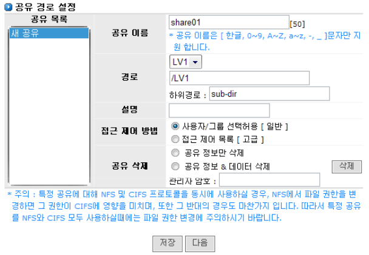
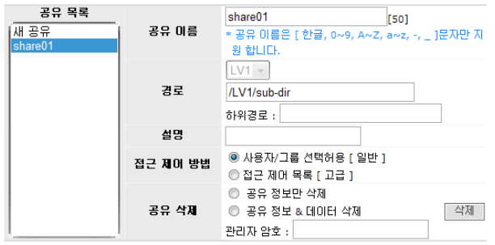
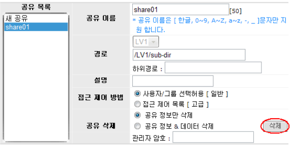

# 6.2 공유 설정

AnyStor NAS의 공유 설정은 \[공유\]-\[설정\] 에서 시작됩니다. 이 메뉴에서의 공유 설정을 바탕으로 CIFS, NFS 및 AppleTalk에 대한 설정을 수행합니다. 동일한 볼륨에 대하여 CIFS, NFS 및 AppleTalk이 동시에 서비스가 가능하며 이 경우 접근 권한은 각각 유지됩니다.

  
 \[ 그림 6.2.1 공유 디렉토리 리스트 추가 \]

## 6.2.1 공유 추가

> ① 공유 볼륨\(디렉터리\)의 설정은 \[공유\]-\[설정\]에서 수행합니다.
>
> ② 공유 이름 입력 창에 공유 이름을 입력합니다. \[그림 6.2.1\]에서는 **‘share01’**로 공유 이름 을 설정한 예를 볼 수 있습니다.
>
> ③ 공유 패스를 설정합니다. 공유 패스는 마운트 되어 있는 볼륨을 기반으로 선택적으로 설 정할 수 있습니다. 공유패스를 설정하는 방법은 볼륨 단위로 하는 방법과 서브 디렉토리 단위로 하는 두 가지 방법이 있습니다. 서브 디렉토리 단위로 공유하고 서브 디렉토리 명 으로 공유 이름을 사용하는 것이 기본이지만 아래와 같은 버튼을 통해 수정이 가능합니 다.

* * 볼륨 공유 : 볼륨 단위로 공유하고자 하는 경우 선택하면 공유명이 없어지고 볼륨 이름만 선택이 가능합니다.

> ④ 설명사항을 입력합니다. 설명은 필수 입력 항목은 아닙니다.
>
> ⑤ 접근제어방법을 설정합니다. 일반설정은 접근을 허용할 사용자 또는 그룹을 선택할 수 있으며 고급설정에서는 ACL 관리자를 통해 사용자 또는 그룹에 읽기 혹은 읽기/쓰기 권 한을 설정할 수 있습니다.
>
> ⑥ 자동 설정된 디렉토리를 공유 디렉토리로 사용할 경우 ‘저장’, 혹은 ‘다음’ 버튼 중의 하나 를 선택하여 누릅니다.
>
> ⑦ **‘저장’**버튼을 클릭할 경우 공유 이름이 공유 리스트에 삽입됩니다.
>
> ⑧ **‘다음’**버튼을 클릭할 경우 CIFS 및 NFS 설정 메뉴로 이어집니다.
>
> ⑨ \[그림 6.2.2\]은 **‘/LV1’** 볼륨을 공유 볼륨으로 설정한 예입니다.

  
 \[ 그림 6.2.2 공유 볼륨 리스트 추가 \]

## 6.2.2  공유 삭제

> ① 공유 리스트에서 제거할 공유 목록을 선택합니다.
>
> ② 삭제할 방식을 선택하고 관리자 비밀번호를 입력합니다.
>
> ③ **‘삭제’**버튼을 클릭하여 해당 공유 목록을 제거합니다.

  
 \[ 그림6.2.3 공유 볼륨\(디렉토리\) 리스트 삭제 \]

## 6.2.3 공유 서비스 상태

> ① \[그림 6.2.1\] 하단에 **“공유 서비스 상태”**는 현재 공유 서비스의 가동 상태를 보여주며, 관리자가 필요 시 재시작을 할 수 있습니다.

