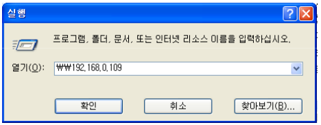
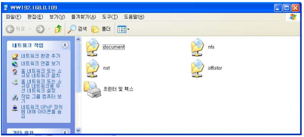

# 6.6 CIFS 및 NFS 서비스 활용

## 6.6.1  CIFS 서비스의 활용

CIFS 서비스를 활용하여 데이터를 공유하거나 스토리지를 활용하기 위해서 다음과 같은 절차에 따라 서 비스를 사용할 수 있습니다.

> ① 공유하고 싶은 논리볼륨을 생성합니다. \[LVM\]
>
> ② 인증방법을 선택합니다. \[네트워크\]
>
> ③ 로컬 사용자를 이용한 인증방식을 사용할 경우 사용자와 그룹을 설정해 줍니다. \[계정\]
>
> ④ 공유 볼륨을 설정하고 CIFS 공유 세부 내용을 설정합니다. \[공유\]-\[설정\]-\[CIFS\]
>
> ⑤ Windows 클라이언트에서 NAS의 공유 디렉토리로 접근합니다. \[그림 6.6.1\]은 **‘192.168.0.109’**로 IP주소가 설정되어 있는 NAS 시스템을 접근하기 위하여 Windows 실행창에서 접근 명령을 입력한 예입니다.

  
 \[ 그림 6.6.1 CIFS 서비스를 이용한 NAS 접근 \]

> ⑥ 공유 목록 및 CIFS 설정이 정상적으로 수행된 경우 \[그림 6.6.2\]와 같이 공유된 디렉터리 들을 볼 수 있습니다. 단, 접근을 시도하는 Windows 클라이언트가 “접근 불가” 리스트에 들어있을 경우 접근할 수 없습니다.

  
 \[ 그림 6.6.2 CIFS 서비스를 이용한 NAS 접근 \]

> ⑦ 공유된 각각의 디렉터리들은 접근 권한에 따라 Windows 클라이언트가 접근할 수 있습 니다. 모든 사용자에게 접근이 허가된 경우는 별도의 사용자 인증 과정 없이 해당 디렉터 리에 접근할 수 있으나, 일반적인 경우 디렉터리에 접근하기 위해서는 인증 과정을 거칩 니다. 인증 시에는 등록된 ID와 패스워드를 필요하며 PDC 서버로 인증하는 경우에는 PD C 서버에 등록되어 있는 ID와 패스워드를 사용하여 접근이 가능합니다.
>
> ⑧ 필요에 따라 각 공유 디렉터리를 네트워크 드라이브로 설정할 수 있습니다.

## 6.6.2 NFS 서비스의 활용

NFS 서비스를 활용하여 데이터를 공유하거나 스토리지를 활용하기 위해서 다음과 같은 절차를 따라 서 비스를 사용할 수 있습니다.

> A. 공유하고 싶은 논리볼륨을 생성합니다. \[LVM\]
>
> B. 서비스 대상이 되는 Secure Zone를 설정합니다. \[네트워크\]-\[보안\]
>
> C. 공유 볼륨을 설정하고 NFS에서 전체 접근 권한 및 호스트별 접근 권한을 설정합니다. \[공유\]-\[설정\]-\[NFS\]
>
> D. 접근 권한이 주어진 Unix 계열 호스트에서 공유 디렉토리를 NFS 서비스를 이용하여 마 운트를 수행합니다. \[그림 6.6.3\]은 NFS 서비스를 이용하여 **‘/testVol1/share1’** 디렉토리 를 클라이언트 호스트에 마운트한 예를 보여주고 있습니다.

  
 \[ 그림 6.6.3 NFS 서비스를 이용한 공유된 디렉토리 접근 \]

> E. 단, 접근을 시도하는 클라이언트 호스트가 **‘접근 불가’** 리스트에 들어있을 경우 접근할 수 없으며, 클라이언트 호스트에 마운트된 공유 목록은 설정된 권한에 따라 읽기 전용 또 는 읽기/쓰기 등의 권한으로 사용될 수 있습니다.

