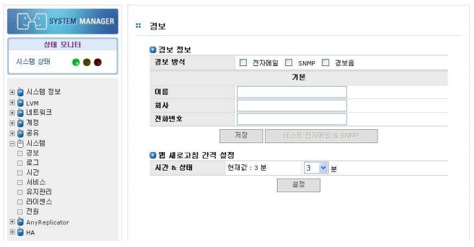

# 7.1 시스템 관리 개요

## 7.1 시스템 관리 개요

\[시스템\] 메뉴에서는 시스템의 동작 및 서비스와 관련된 다양한 관리 기능을 제공합니다. 시스템 메뉴에서 제공하는 기능들을 간단히 정리하면 다음과 같습니다.

> A. \[경보\]- 경고 설정: 시스템 이상 시 경고 전송을 위한 관리자 E-Mail, SNMP, 알람 설정 및 웹 화면 갱신 시간 설정
>
> B. \[로그\]- 로그 관리: 시스템의 다양한 로그 관리 및 로그 뷰 제공
>
> C. \[시간\]- 시간 설정: 시스템 시간 설정
>
> D. \[서비스\]- 서비스 설정: 서비스 데몬의 구동 및 종료
>
> E. \[유지관리\]- 유지 보수: 시스템의 유지 보수 제공
>
> F. \[라이센스\]- 라이선스 관리: 시스템의 라이선스를 등록
>
> G. \[전원\]- 시스템 종료 : 시스템 종료 및 재시작 기능 제공

  
 \[ 그림 7.1.1 시스템 초기 화면\]

