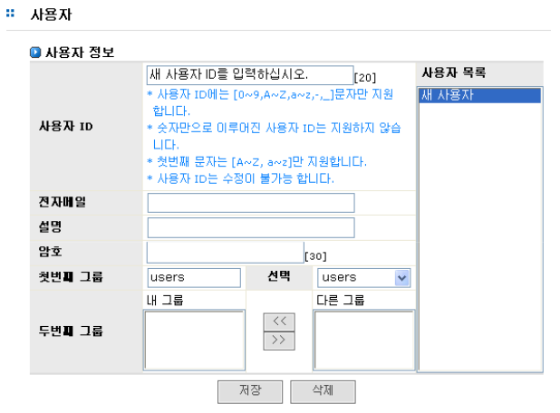

# 5.2 사용자

사용자 계정 관리 메뉴에서는 사용자 계정의 삽입, 삭제, 변경 및 사용자에 대한 그룹 설정이 가능합니 다. 사용자 계정 관리는 \[계정\]-\[사용자\] 메뉴에서 수행하며, 다음과 같은 순서로 설정합니다.   
  
 \[그림 5.2\]는 사용자 계정을 관리 페이지 입니다.

   
 \[ 그림 5.2 사용자 계정의 관리 \]

## 5.2.1 사용자 계정 입력

> ① 사용자 ID, 전자메일 주소, 설명 및 암호 입력
>
> ② 첫번째 그룹의 선택. 첫번째 그룹이 선택된 경우 사용자는 첫번째 그룹 멤버에 속하게 됩 니다.
>
> ③ 두번째 그룹의 선택. 두번째 그룹의 선택은 단일 그룹이 아닌 다중의 그룹 선택이 가능합 니다. 다중의 두번째 그룹이 선택된 경우 사용자는 선택된 모든 그룹의 멤버로 가입이 됩 니다. 그룹은 공유 디렉토리에 대한 그룹에 대한 접근 권한 설정 시 사용합니다.
>
> ④ 위의 사항이 모두 입력된 경우 저장합니다.

## 5.2.2 사용자 계정 변경

> ① 변경하려고 하는 사용자를 **‘사용자 목록’**에서 선택합니다.
>
> ② 변경할 사용자 정보를 입력합니다.
>
> ③ 모두 변경한 후 **‘저장’**버튼을 클릭합니다.

## 5.2.3 사용자 계정 삭제

> ① 삭제하고자 하는 사용자를 **‘사용자 목록’**에서 선택합니다.
>
> ② **‘삭제’**버튼을 클릭하여 삭제합니다.

