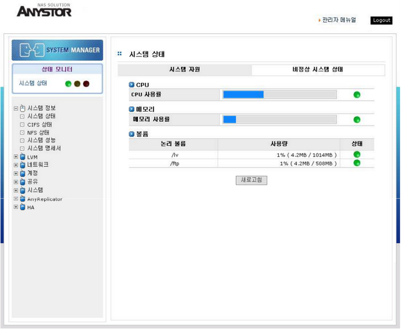

# 1.2  AnyManager 메인 화면

AnyStor NAS의 관리를 위한 메인 관리 화면은 다음과 같습니다.  
메인 메뉴는 왼쪽 편에 있으며, 오른편 화면에는 각각의 메인 메뉴에 해당하는 서브 메뉴와 서브 메뉴에 해당하는 화면으로 구성됩니다.   
  

   
 \[ 그림 1.2 AnyManager 메인 관리화면 \]

## 1.2.1 상태 모니터

상태 모니터에는 정상적인 상태 시는 시스템 상태부분에 녹색볼이 나타나며 시스템 상태부분을 클릭 시 오른쪽 화면에 일부 시스템 자원의 상태를 보여주며 시스템 상태가 비정상적이거나 주의를 할 사항이 있을 시는 시스 템 상태 부분에 황색볼이나 적색볼이 나타나며 시스템 상태 부분을 클릭 시 오른쪽 화면에 상태가 비정 상적이거나 주의를 할 사항들의 정보 목록을 보실 수 있습니다

## 1.2.2 메뉴

메인 메뉴와 서브 메뉴 및 각 메뉴에 대한 기능이 아래에 간단하게 설명되어 있습니다.

| Menu | Sub Menu | Functions |
| :--- | :--- | :--- |
| **Logout** |  | AnyStor NAS GW 세션 종료 |
| **시스템 정보** | 시스템 정보 | CPU, Memory, Hardware, 볼륨 정보 |
|  | CIFS 상태 | CIFS 서비스 상태 |
|  | NFS 상태 | NFS 서비스 상태 |
|  | 디스크 상태 | OS 디스크 상태 또는 스토리지 디스크 상태 |
|  | 시스템 성능 | CPU, Memory 사용률, Storage I/O, Network I/O, NFS 서버 IOPS 모니터링 결과 히스토리 |
|  | 시스템 명세서 | CPU, Memory, NIC, HBA 정보 |
| **LVM** | 논리 디스크 | 논리 디스크 관리 |
|  | 논리 볼륨 | 논리 볼륨 관리 |
|  | Tree Quota | Tree Quota 관리 |
| **네트워크** | 네트워크 설정 | 네트워크 정보 설정 |
|  | 공유 네트워크 구성 | CIFS 네트워크 환경 설정 및 ADS 설정 |
|  | 보안 | Host 접근 권한 설정 |
|  | Link Aggregation | Link Aggregation 설정 및 관리 |
|  | 라우팅 | 라우팅 테이블 관리 |
| **계정** | 사용자 | 사용자 계정 |
|  | 그룹 | 그룹 계정 |
| **공유** | 설정 | 공유이름 및 경로 설정 |
|  | CIFS | Global, Host, Group and 사용자 Privilege |
|  | NFS | Global and Host Privilege |
|  | AppleTalk | Global, Group and 사용자 Privilege |
|  | 관리자 | 관리자 계정 |
| **시스템** | 경보 | 관리자 E-mail 및 정보 설정 |
|  | 로그 | Command, Event and Volume log |
|  | 시간 | 시스템 날짜 및 시간 설정, 시간 표준화 |
|  | 서비스 | CIFS, NFS, SNMP, NDMP 서비스 Daemon |
|  | 유지관리 | System Config and 로그 Backup,    버전 업그레이드, 시스템 설정 정보 재설정 및 초기화 |
|  | 라이센스 | AnyStor 라이센스 관리 |
|  | 전원 | Quick Reboot, Quick 전원끄기, 시스템 체크 |

