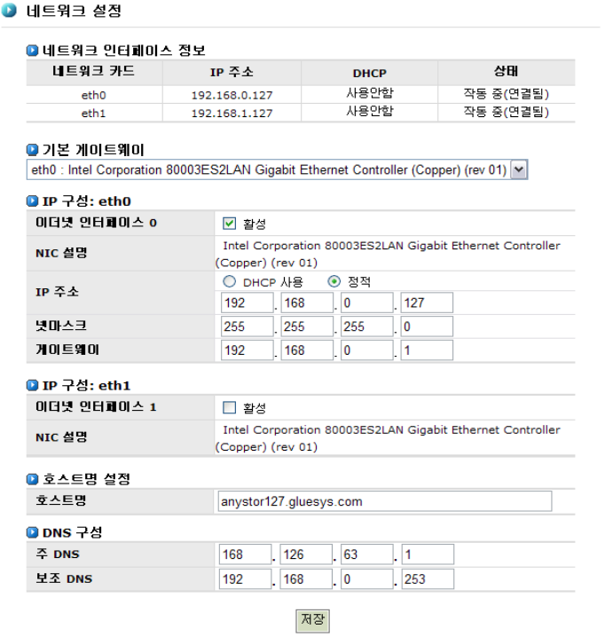
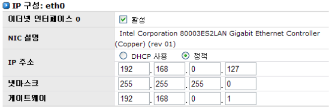

# 4.1 계정 개요

  
 AnyStor NAS는 네트워크 스토리지입니다. 따라서 외부의 클라이언트가 네트워크를 통해 AnyStor N AS에 접속할 수 있도록 IP 주소를 포함한 네트워크의 설정이 필요합니다. AnyStor NAS는 AnyStor 웹 관리 도구를 활용하여 모든 네트워크 설정이 가능합니다.

  
 AnyStor 웹 관리 도구를 통한 네트워크 설정은 다음과 같습니다.

> A. 네트워크 설정
>
> B. 보안
>
> C. 공유 네트워크 구성
>
> D. NIS 설정
>
> E. Link Aggregation
>
> F. 라우팅

## 4.1 네트워크 설정

\[그림 4.1.1\]은 네트워크 기본 설정을 위한 GUI입니다. 네트워크 기본 설정을 위해 수행할 사항은 다음과 같습니다.

> A. 기본 게이트웨이 : 네트워크 기본 게이트웨이 인터페이스를 설정
>
> B. IP 구성: 각 네트워크 인터페이스에 대한 IP주소, 넷 마스크, 게이트웨이 설정
>
> C. 호스트명 설정: NAS 장비의 호스트명 설정
>
> D. DNS 설정 : 기본 DNS 및 보조 DNS 설정

   
 \[ 그림 4.1.1 네트워크 기본 설정을 위한 GUI \]

### ▶ 네트워크 정보

> 각 네트워크 인터페이스에 대한 정보를 보여줍니다. \[그림 4.1.2\]은 각 네트워크 인터페이스에 대한 정보 를 보여주는 GUI입니다.

   
 \[ 그림 4.1.2 네트워크 인터페이스 정보 \]

### ▶ 기본 게이트웨이 설정

> 기본 게이트웨이를 설정할 네트워크 인터페이스를 선택합니다. \[그림 4.1.3\]은 기본 게이트웨이를 설정 하는 GUI입니다.

   
 \[ 그림 4.1.3 기본 게이트웨이 설정 \]

### ▶ IP 설정

각 네트워크 인터페이스에 대한 IP 설정을 할 수 있습니다. 다수의 IP가 존재할 경우 시스템 내에 존재하 는 네트워크 인터페이스의 수 만큼의 설정 인터페이스가 생성됩니다. 따라서 관리자는 생성된 설정 인 터페이스에 각 네트워크 어댑터에 대한 설정 값을 입력할 수 있습니다. \[그림 4.1.4\]는 IP 설정을 위한 G UI 입니다.   
 IP 설정은 다음과 같은 순서로 수행합니다.

   
 \[ 그림 4.1.4 IP 설정 \]

> A. **‘이더넷 인터페이스 0’**에 대한 사용 여부를 설정
>
> B. 호스트 이름 설정
>
> C. DHCP를 사용할 경우 DHCP로 IP를 할당받도록 설정
>
> D. DHCP로 IP 주소를 할당받지 않을 경우 IP 주소 설정\(예 : 163.152.39.135\)
>
> E. 넷마스크 설정\(예 : 255.255.255.0\)
>
> F. 게이트웨이 설정\(예 : 163.152.1.1\)
>
> G. 2개 이상의 이더넷 인터페이스가 존재할 경우 위 순서와 동일하게 IP 설정을 반복

### ▶ 호스트명 설정

   
 \[ 그림 4.1.5 호스트명 설정 \]

> ① 호스트명을 입력합니다.
>
> ② 설정이 끝나면 **저장** 버튼을 클릭합니다.

### ▶ DNS 설정

   
 \[ 그림 4.1.6 DNS 설정 \]

> ① 주 DNS를 설정합니다.
>
> ② 보조 DNS를 설정합니다. 이 값은 옵션 사항입니다.
>
> ③ 모든 설정이 끝나면 **저장** 버튼을 클릭합니다.

