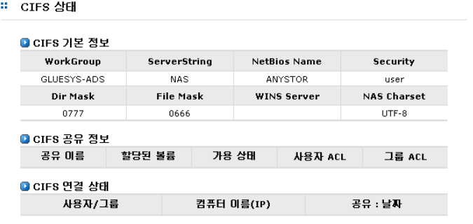

# 2.2  CIFS 상태

CIFS의 상태는 \[\[시스템 정보\]-\[CIFS 상태\] 메뉴에서 확인할 수 있습니다. \[그림 2.2.1\]는 CIFS 서비스의 상태 정보를 표시하는 예입니다.  
  
 표시되는 정보는 다음과 같습니다.

## ▶ CIFS 기본 정보

Windows 네트워크를 사용하는 클라이언트와의 연결 환경 설정을 볼 수 있습니다. 수정 가능한 부분과 AnyStor 정책 상 고정된 부분이 있습니다.

* WorkGroup : Windows 네트워크 환경의 어떤 Work 그룹에 참여할 지 나타냅니다. [\[네트워크\]-\[공유 네트워크 구성\]-**”워크그룹”**](cifs.md#43-공유-네트워크-구성)에서 설정할 수 있습니다.
* Server String : Windows 네트워크 환경 하에서 AnyStor에 대한 설명을 보여줍니다. [\[네트워크\]-\[공유 네트워크 구성\]-**”설명”**](cifs.md#43-공유-네트워크-구성)에서 설정할 수 있습니다.
* NetBios Name : Windows 네트워크 환경에서 사용할 컴퓨터 이름을 나타냅니다. [\[네트워크\]-\[공유 네트워크 구성\]-**”넷바이오스 이름”**](cifs.md#43-공유-네트워크-구성)에서 설정할 수 있습니다.
* Security : [\[네트워크\]-\[공유 네트워크 구성\]](cifs.md#43-공유-네트워크-구성)에서 설정한 **“인증방식”**의 설정 정보를 보여줍니다. 도메인 컨트롤러 인증을 사용하는 경우 

  **“ads\(Active Directory Service\)”**라고 표시됩니다.

* Dir Mask : Windows 사용자가 디렉토리를 생성할 경우 자동으로 생성되는 퍼미션을 나타내며, 고정값입니다.
* File Mask : Windows 사용자가 파일을 생성할 경우 자동으로 생성되는 퍼미션을 나타내며, 고정값입니다.
* WINS Server : [\[네트워크\]-\[공유 네트워크 구성\]-**“WINS 서버”**](cifs.md#43-공유-네트워크-구성)에서 설정할 수 있습니다.
* NAS Charset : AnyStor Character set을 나타내며, 나라별 언어 설정 및 문자 타입 등을 보여줍니다.

## ▶ CIFS 공유 정보

* 공유 이름 : CIFS 프로토콜에 등록된 공유 이름
* 할당된 볼륨 : 공유가 속한 논리 볼륨 이름
* 가용 상태 : 사용 가능 여부 표시
* 사용자 ACL : 해당 공유에 접근이 가능한 사용자와 퍼미션 정보
* 그룹 ACL : 해당 공유에 접근이 가능한 그룹과 퍼미션 정보

## ▶ CIFS 연결 상태 : CIFS로 AnyStor에 접속한 클라이언트 정보

* 사용자 / 그룹 : 접속한 사용자와 그룹 이름
* 컴퓨터 이름\(IP\) : 접속한 컴퓨터 이름과 그 아이피 주소
* 공유 : 날짜 : 접속한 공유 이름과 접속한 날짜

     

      \[ 그림 2.2.1  CIFS 상태 \]

