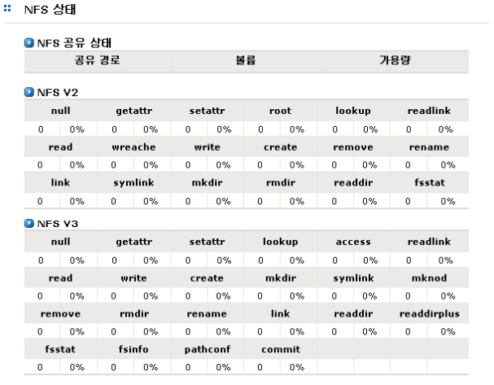

# 2.3  NFS 상태

NFS의 상태는 \[시스템 정보\]-\[NFS 상태\] 메뉴에서 확인할 수 있습니다.  
 \[그림 2.3.1\]은 NFS 서비스의 상태 정보를 표시하는 예입니다. 표시되는 정보는 각 공유 디렉터리에 대 한 사용량과, NFS V2, V3에 대한 상태 정보 입니다.   
  
    
     \[ 그림 2.3.1 NFS 서비스 상태 정보 \]

